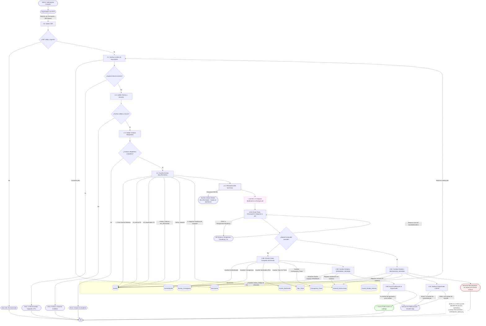

---

## 📋 CAMBIOS CLAVE vs VERSIÓN SÍNCRONA

### **ANTES (Síncrona - Problemática):**
```
User crea evento
    ↓
Valida JWT, plan, fechas
    ↓
Espera API de moderación (500ms-2s) ← BLOQUEA
    ↓
Si aprobado → guarda APROBADO
Si rechazado → guarda RECHAZADO
    ↓
Response al user
```

### **DESPUÉS (Asíncrona - Correcta):**
```
User crea evento
    ↓
Valida JWT, plan, fechas (rápido)
    ↓
Guarda inmediatamente con estado EN_PROCESO
    ↓
Response 200 OK → "Tu evento está siendo validado..."
    ↓
[Background] API de moderación corre en paralelo
    ↓
Resultado → Cambia estado a APROBADO/RECHAZADO
    ↓
Notifica al usuario del cambio
    ↓
Si rechazado → Admin lo ve en panel para revisar
```

---

## 🎯 Ventajas del Flujo Asíncrono

| Aspecto | Síncrona (ANTES) | Asíncrona (DESPUÉS) |
|--------|--------|--------|
| **Experiencia del User** | Espera 500ms-2s | Feedback inmediato (200 OK) |
| **Dashboard del Org** | Vacío hasta que se aprueba | Muestra evento EN_PROCESO inmediatamente |
| **Timeout de API** | Bloquea creación | No afecta (ocurre después) |
| **Auditoría** | Parcial | Completa (aprobado + notificado + estado) |
| **Admin Override** | Difícil de revertir | Fácil (RF-6.1: cambiar estado) |
| **Escalabilidad** | Baja (bloquea) | Alta (background tasks) |

---

## 💡 Flujo de Estados del Evento

```
INICIO (en formulario)
    ↓
EN_PROCESO (creado, validando)
    ├─→ APROBADO_SISTEMA (moderación OK) ← visible en catálogo
    ├─→ RECHAZADO_SISTEMA (moderación falló) ← oculto, en panel admin
    └─→ APROBADO_MANUAL (admin lo revierte)
        RECHAZADO_MANUAL (admin confirma rechazo)
```

---

## 📝 Notas de Implementación

1. **Background Task:** Usar Job Queue (sidekiq, celery, etc.) para disparar moderación
2. **Notificaciones:** Enviar email/in-app cuando estado cambie
3. **Admin Panel:** Debe mostrar eventos EN_PROCESO y RECHAZADO_SISTEMA para revisión
4. **Rollback:** Si API cae → evento queda EN_PROCESO (manual recovery)
5. **Timeout:** Si moderación >N minutos → timeout, marcar como EN_REVISIÓN_MANUAL

---

**Versión:** PROPUESTA para revisión 2026-08-12  
**Estado:** Pendiente aprobación  
**Cambios respecto a DFD original:** Cambio a asíncrono (RF-2.2 actualizado)
```

