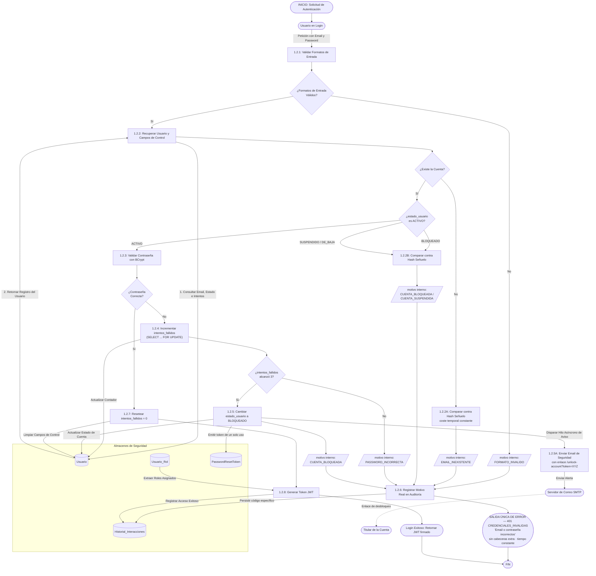
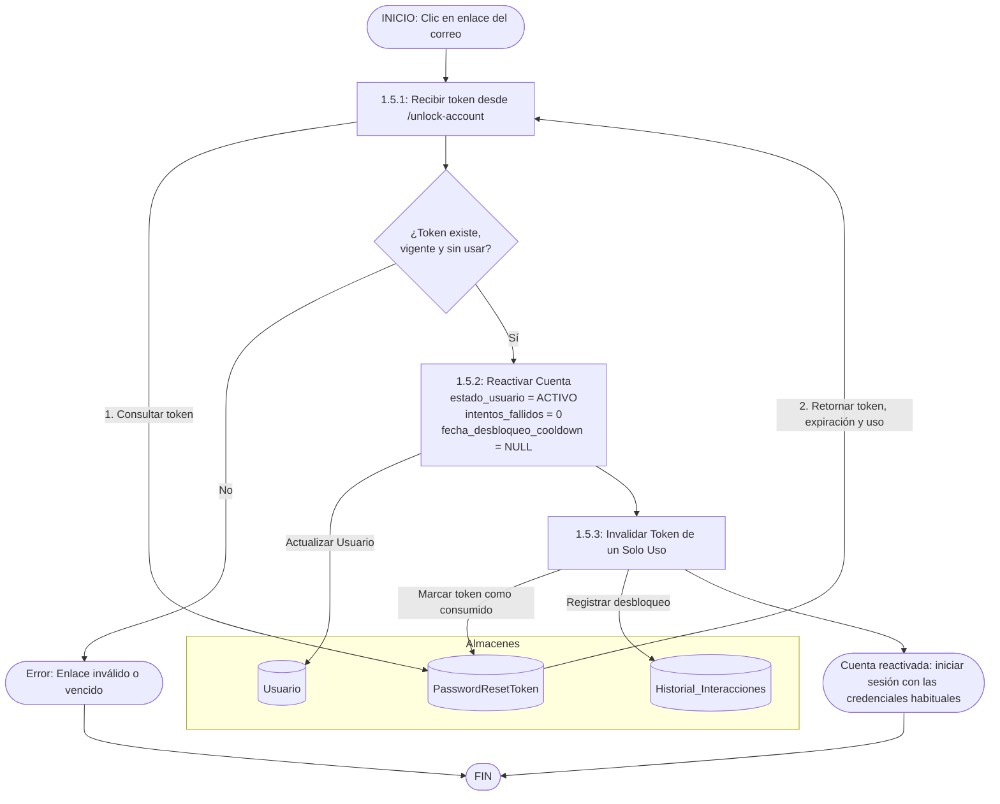

# DFD 1.2 — Inicio de Sesión

> **Revisado 2026-09-09.** Reemplaza la versión anterior, que describía control de tráfico por IP,
> una escalera de penalización 3/6/9, verificación CAPTCHA y un segundo factor por correo (2FA).
> Ninguno de esos cuatro mecanismos forma parte del alcance vigente:
>
> | Mecanismo anterior | Estado | Motivo |
> |---|---|---|
> | Rate limiting por IP (`1.2.1`) | ❌ eliminado | Detrás de CGNAT bloquea a cientos de usuarios legítimos por un solo atacante (RF-1.4) |
> | Escalera 3 → 6 → 9 fallos | ❌ reemplazada | Decisión final: **bloqueo directo al 3° fallo** (RF-1.4) |
> | CAPTCHA (`1.2.4A`) | ⏸️ diferido | Fuera del alcance actual |
> | 2FA por correo (`1.2.8`/`1.2.9`) | ⏸️ diferido | Fuera del alcance actual |
> | `Err_Block` ("Cuenta Bloqueada por Seguridad") | ❌ eliminado | Revelaba el estado de la cuenta al atacante; ahora el rechazo es **indistinguible** |

## Principio rector: **una sola salida de error**

Todas las rutas de rechazo convergen en `Err_Generico`. Desde fuera son idénticas en
código HTTP (401), código de aplicación (`CREDENCIALES_INVALIDAS`), mensaje, cabeceras y
**tiempo de respuesta**. El motivo real se bifurca únicamente hacia el log y la auditoría.

## DFD 1.5 — Desbloqueo de Cuenta por Enlace de Correo

> **Especificado, pendiente de implementación.** Cubre el consumo del enlace que RF-1.4 envía al titular.

