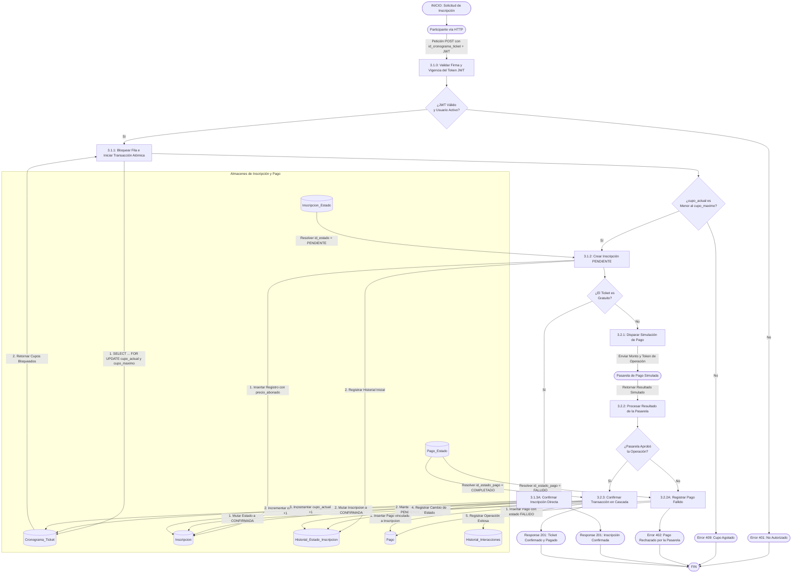

```mermaid
graph TD
    %% Punto de Inicio Único
    INICIO([INICIO: Solicitud de Inscripción]) --> Part([Participante vía HTTP])
    Part -->|Petición POST con id_cronograma_ticket + JWT| P3_1_0[3.1.0: Validar Firma y Vigencia del Token JWT]

    %% Almacenes de Datos
    subgraph Almacenes de Inscripción y Pago
        D13_Tkt[(Cronograma_Ticket)]
        D15_Insc[(Inscripcion)]
        D15_Est[(Inscripcion_Estado)]
        D15_Hist[(Historial_Estado_Inscripcion)]
        D18_Pago[(Pago)]
        D19_PagoEst[(Pago_Estado)]
        D6_Logs[(Historial_Interacciones)]
    end

    Pasarela([Pasarela de Pago Simulada])

    %% 0. AUTENTICACIÓN
    P3_1_0 --> C_Token{¿JWT Válido<br>y Usuario Activo?}
    C_Token -->|No| Err_Auth([Error 401: No Autorizado])
    C_Token -->|Sí| P3_1_1[3.1.1: Bloquear Fila e Iniciar Transacción Atómica]

    %% 1. CONTROL DE CONCURRENCIA (ATOMICIDAD - @Transactional)
    P3_1_1 -->|1. SELECT ... FOR UPDATE cupo_actual y cupo_maximo| D13_Tkt
    D13_Tkt -->|2. Retornar Cupos Bloqueados| P3_1_1
    P3_1_1 --> C_Cupo{¿cupo_actual es<br>Menor al cupo_maximo?}
    C_Cupo -->|No| Err_Cupo([Error 409: Cupo Agotado])
    C_Cupo -->|Sí| P3_1_2[3.1.2: Crear Inscripción PENDIENTE]

    %% 2. CREACIÓN DE INSCRIPCIÓN
    P3_1_2 -->|1. Insertar Registro con precio_abonado| D15_Insc
    D15_Est -->|Resolver id_estado = PENDIENTE| P3_1_2
    P3_1_2 -->|2. Registrar Historial Inicial| D15_Hist
    P3_1_2 --> C_EsGratis{¿El Ticket es<br>Gratuito?}

    %% CAMINO A: TICKET GRATUITO (Confirmación Directa)
    C_EsGratis -->|Sí| P3_1_3A[3.1.3A: Confirmar Inscripción Directa]
    P3_1_3A -->|1. Mutar Estado a CONFIRMADA| D15_Insc
    P3_1_3A -->|2. Incrementar cupo_actual +1| D13_Tkt
    P3_1_3A -->|3. Registrar Cambio de Estado| D15_Hist
    P3_1_3A --> Success_Gratis([Response 201: Inscripción Confirmada])

    %% CAMINO B: TICKET DE PAGO (RF-3.2 Simulación de Pago)
    C_EsGratis -->|No| P3_2_1[3.2.1: Disparar Simulación de Pago]
    P3_2_1 -->|Enviar Monto y Token de Operación| Pasarela
    Pasarela -->|Retornar Resultado Simulado| P3_2_2[3.2.2: Procesar Resultado de la Pasarela]

    P3_2_2 --> C_PagoOk{¿Pasarela Aprobó<br>la Operación?}

    %% CAMINO B.1: PAGO RECHAZADO
    C_PagoOk -->|No| P3_2_2A[3.2.2A: Registrar Pago Fallido]
    P3_2_2A -->|1. Insertar Pago con estado FALLIDO| D18_Pago
    D19_PagoEst -->|Resolver id_estado_pago = FALLIDO| P3_2_2A
    P3_2_2A -->|2. Mantener Inscripción en PENDIENTE_PAGO| D15_Insc
    P3_2_2A --> Err_Pago([Error 402: Pago Rechazado por la Pasarela])

    %% CAMINO B.2: PAGO APROBADO (Transacción en Cascada)
    C_PagoOk -->|Sí| P3_2_3[3.2.3: Confirmar Transacción en Cascada]
    P3_2_3 -->|1. Insertar Pago vinculado a Inscripcion| D18_Pago
    D19_PagoEst -->|Resolver id_estado_pago = COMPLETADO| P3_2_3
    P3_2_3 -->|2. Mutar Inscripcion a CONFIRMADA| D15_Insc
    P3_2_3 -->|3. Incrementar cupo_actual +1| D13_Tkt
    P3_2_3 -->|4. Registrar Cambio de Estado| D15_Hist
    P3_2_3 -->|5. Registrar Operación Exitosa| D6_Logs
    P3_2_3 --> Success_Pago([Response 201: Ticket Confirmado y Pagado])

    %% Unificación de Salidas (Punto de Fin Único)
    Err_Auth --> FIN([FIN])
    Err_Cupo --> FIN
    Err_Pago --> FIN
    Success_Gratis --> FIN
    Success_Pago --> FIN
```
