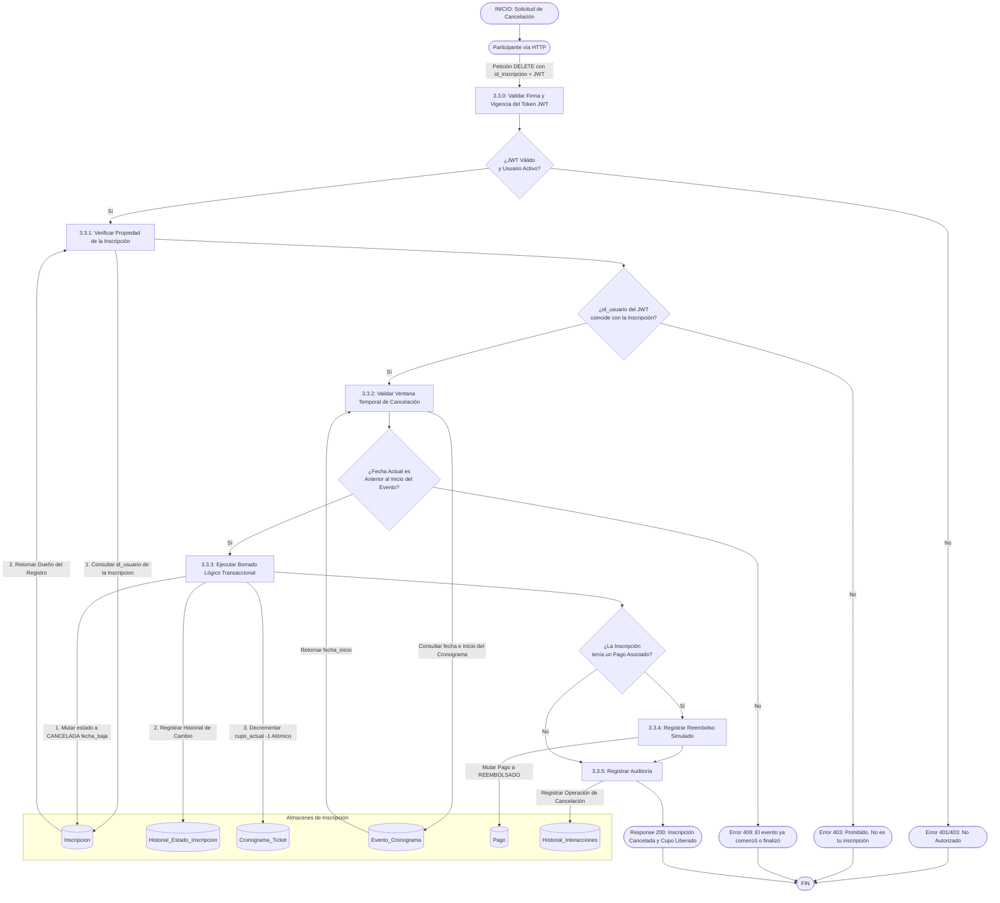

```mermaid
graph TD
    %% Punto de Inicio Único
    INICIO([INICIO: Solicitud de Cancelación]) --> Part([Participante vía HTTP])
    Part -->|Petición DELETE con id_inscripcion + JWT| P3_3_0[3.3.0: Validar Firma y Vigencia del Token JWT]

    %% Almacenes de Datos
    subgraph Almacenes de Inscripción
        D15_Insc[(Inscripcion)]
        D15_Hist[(Historial_Estado_Inscripcion)]
        D13_Tkt[(Cronograma_Ticket)]
        D11_Cro[(Evento_Cronograma)]
        D18_Pago[(Pago)]
        D6_Logs[(Historial_Interacciones)]
    end

    %% 0. AUTENTICACIÓN Y RBAC
    P3_3_0 --> C_Token{¿JWT Válido<br>y Usuario Activo?}
    C_Token -->|No| Err_Auth([Error 401/403: No Autorizado])
    C_Token -->|Sí| P3_3_1[3.3.1: Verificar Propiedad de la Inscripción]

    %% 1. CONTROL DE PERTENENCIA
    P3_3_1 -->|1. Consultar id_usuario de la Inscripcion| D15_Insc
    D15_Insc -->|2. Retornar Dueño del Registro| P3_3_1
    P3_3_1 --> C_Dueno{¿id_usuario del JWT<br>coincide con la Inscripción?}
    C_Dueno -->|No| Err_Permiso([Error 403: Prohibido. No es tu inscripción])
    C_Dueno -->|Sí| P3_3_2[3.3.2: Validar Ventana Temporal de Cancelación]

    %% 2. VALIDACIÓN DE FECHA LÍMITE
    P3_3_2 -->|Consultar fecha e Inicio del Cronograma| D11_Cro
    D11_Cro -->|Retornar fecha_inicio| P3_3_2
    P3_3_2 --> C_Fecha{¿Fecha Actual es<br>Anterior al Inicio del Evento?}
    C_Fecha -->|No| Err_Fecha([Error 409: El evento ya comenzó o finalizó])
    C_Fecha -->|Sí| P3_3_3[3.3.3: Ejecutar Borrado Lógico Transaccional]

    %% 3. BORRADO LÓGICO (NO DELETE FÍSICO)
    P3_3_3 -->|1. Mutar estado a CANCELADA fecha_baja| D15_Insc
    P3_3_3 -->|2. Registrar Historial de Cambio| D15_Hist
    P3_3_3 -->|3. Decrementar cupo_actual -1 Atómico| D13_Tkt
    P3_3_3 --> C_TuvoPago{¿La Inscripción<br>tenía un Pago Asociado?}

    %% 4. REVERSIÓN DE PAGO SI APLICA
    C_TuvoPago -->|Sí| P3_3_4[3.3.4: Registrar Reembolso Simulado]
    P3_3_4 -->|Mutar Pago a REEMBOLSADO| D18_Pago
    P3_3_4 --> P3_3_5[3.3.5: Registrar Auditoría]
    C_TuvoPago -->|No| P3_3_5

    P3_3_5 -->|Registrar Operación de Cancelación| D6_Logs
    P3_3_5 --> Success_Cancel([Response 200: Inscripción Cancelada y Cupo Liberado])

    %% Unificación de Salidas (Punto de Fin Único)
    Err_Auth --> FIN([FIN])
    Err_Permiso --> FIN
    Err_Fecha --> FIN
    Success_Cancel --> FIN
```
