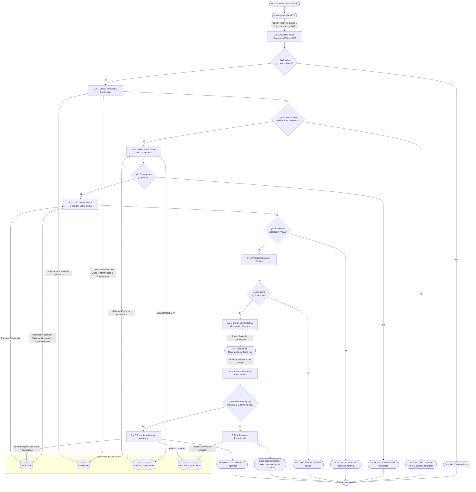

```mermaid
graph TD
    %% Punto de Inicio Único
    INICIO([INICIO: Envío de Valoración]) --> Part([Participante vía HTTP])
    Part -->|Petición POST con valor 1-5 + comentario + JWT| P3_4_0[3.4.0: Validar Firma y Vigencia del Token JWT]

    %% Almacenes de Datos
    subgraph Almacenes de Valoración
        D16_Val[(Valoracion)]
        D15_Insc[(Inscripcion)]
        D11_Cro[(Evento_Cronograma)]
        D6_Logs[(Historial_Interacciones)]
    end

    API_Mod([API Externa de Moderación de Texto / IA])

    %% 0. AUTENTICACIÓN Y RBAC
    P3_4_0 --> C_Token{¿JWT Válido<br>y Usuario Activo?}
    C_Token -->|No| Err_Auth([Error 401: No Autorizado])
    C_Token -->|Sí| P3_4_1[3.4.1: Validar Asistencia Confirmada]

    %% 1. VALIDACIÓN DE ELEGIBILIDAD
    P3_4_1 -->|1. Consultar Inscripcion CONFIRMADA para el Cronograma| D15_Insc
    D15_Insc -->|2. Retornar Estado de Asistencia| P3_4_1
    P3_4_1 --> C_Asistio{¿Participante tuvo<br>Inscripción Confirmada?}
    C_Asistio -->|No| Err_NoAsistio([Error 403: Solo pueden valorar quienes asistieron])
    C_Asistio -->|Sí| P3_4_2[3.4.2: Validar Finalización del Cronograma]

    P3_4_2 -->|Consultar fecha_fin| D11_Cro
    D11_Cro -->|Retornar Fecha de Finalización| P3_4_2
    P3_4_2 --> C_Finalizo{¿El Cronograma<br>ya Finalizó?}
    C_Finalizo -->|No| Err_NoFin([Error 409: El evento aún no finalizó])
    C_Finalizo -->|Sí| P3_4_3[3.4.3: Validar Restricción Única por Cronograma]

    %% 2. VALIDACIÓN DE UNICIDAD (RF-3.4)
    P3_4_3 -->|Consultar Valoracion Existente id_usuario + id_cronograma| D16_Val
    D16_Val -->|Retornar Existencia| P3_4_3
    P3_4_3 --> C_YaValoro{¿Ya Existe una<br>Valoración Previa?}
    C_YaValoro -->|Sí| Err_Duplicado([Error 409: Ya valoraste este cronograma]) 
    C_YaValoro -->|No| P3_4_4[3.4.4: Validar Rango del Puntaje]

    P3_4_4 --> C_Rango{¿Valor entre<br>1 y 5 Inclusive?}
    C_Rango -->|No| Err_Rango([Error 400: Puntaje fuera de rango])
    C_Rango -->|Sí| P3_5_1[3.5.1: Enviar Comentario a Moderación Síncrona]

    %% 3. MODERACIÓN SÍNCRONA DE TEXTO (RF-3.5)
    P3_5_1 -->|Enviar Texto del Comentario| API_Mod
    API_Mod -->|Retornar Resultado del Análisis| P3_5_2[3.5.2: Evaluar Resultado de Moderación]

    P3_5_2 --> C_Ofensivo{¿API detectó Lenguaje<br>Ofensivo o Discriminatorio?}

    %% CAMINO A: RESEÑA RECHAZADA (No se persiste, no afecta BD)
    C_Ofensivo -->|Sí| P3_5_2A[3.5.2A: Bloquear Persistencia]
    P3_5_2A -->|Registrar Intento de Infracción| D6_Logs
    P3_5_2A --> Err_Moderacion([Error 422: Comentario viola directrices de la comunidad])

    %% CAMINO B: RESEÑA APROBADA
    C_Ofensivo -->|No| P3_4_5[3.4.5: Persistir Valoración Aprobada]
    P3_4_5 -->|Insertar Registro con valor y comentario| D16_Val
    P3_4_5 -->|Registrar Auditoría| D6_Logs
    P3_4_5 --> Success_Val([Response 201: Valoración Registrada])

    %% Unificación de Salidas (Punto de Fin Único)
    Err_Auth --> FIN([FIN])
    Err_NoAsistio --> FIN
    Err_NoFin --> FIN
    Err_Duplicado --> FIN
    Err_Rango --> FIN
    Err_Moderacion --> FIN
    Success_Val --> FIN
```
