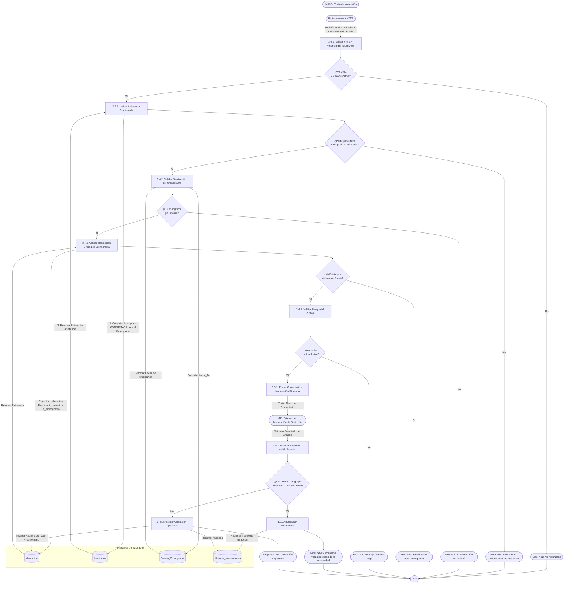
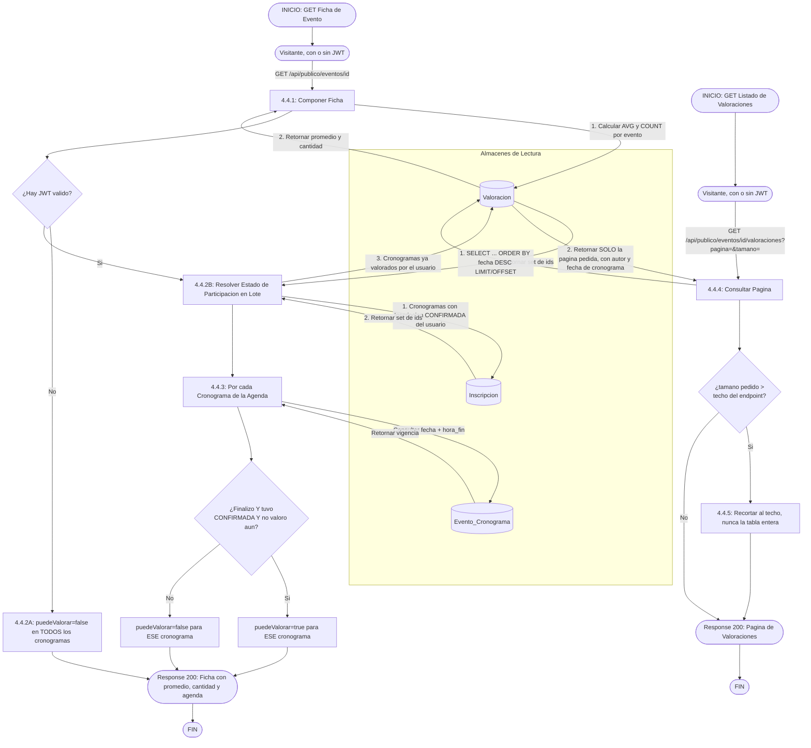

---

## Lectura: listado público paginado y elegibilidad (RF-3.4, RF-4.4)

El diagrama de arriba cubre solo el envío (POST). Este cubre el otro lado, que
la ficha pública de un evento necesita para pintar la sección "Opiniones de
la Comunidad": el listado en sí (paginado, no todo de una) y la marca
`puedeValorar` por cronograma, que evita ofrecerle a un visitante un
formulario que el POST de arriba va a rechazar de antemano.

**Por que "puedeValorar" se calcula en el backend y no en el frontend**
Ya es el criterio que se uso para `finalizado`/`yaInscripto` (RF-3.1) en esta
misma ficha: el frontend nunca tiene, por si solo, la relacion completa
usuario-inscripcion-cronograma-valoracion, y duplicar esa logica en
JavaScript garantiza que un dia diverja del backend (por ejemplo, si cambia
la regla de "cuanto dura la ventana para valorar"). El backend calcula una
vez, en lote, para toda la agenda del evento -- una consulta por cronograma
seria el N+1 de siempre.

**Por que el listado es un endpoint aparte de la ficha**
La ficha (arriba) SI necesita el promedio y la cantidad para pintar el header
apenas carga la pantalla (son dos numeros). Las reseñas en si son una lista
que puede crecer sin limite; mezclarlas en la misma respuesta que agenda,
tickets e imagenes volveria pesada la ficha de cualquier evento popular. El
techo de tamaño de pagina (`TAMANO_PAGINA_VALORACIONES_MAXIMO`) existe por el
mismo motivo que el del catalogo (`?tamano=1000000` no puede traer la tabla
entera a memoria).
