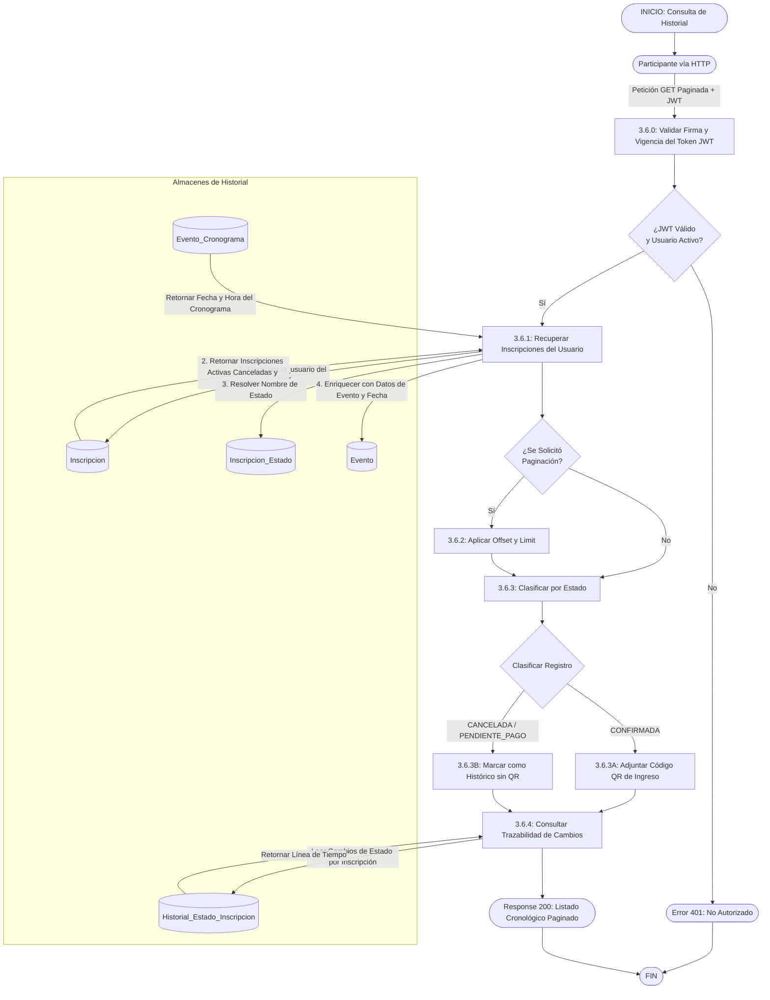

```mermaid
graph TD
    %% Punto de Inicio Único
    INICIO([INICIO: Consulta de Historial]) --> Part([Participante vía HTTP])
    Part -->|Petición GET Paginada + JWT| P3_6_0[3.6.0: Validar Firma y Vigencia del Token JWT]

    %% Almacenes de Datos
    subgraph Almacenes de Historial
        D15_Insc[(Inscripcion)]
        D15_Est[(Inscripcion_Estado)]
        D15_Hist[(Historial_Estado_Inscripcion)]
        D10_Ev[(Evento)]
        D11_Cro[(Evento_Cronograma)]
    end

    %% 0. AUTENTICACIÓN Y RBAC
    P3_6_0 --> C_Token{¿JWT Válido<br>y Usuario Activo?}
    C_Token -->|No| Err_Auth([Error 401: No Autorizado])
    C_Token -->|Sí| P3_6_1[3.6.1: Recuperar Inscripciones del Usuario]

    %% 1. LECTURA DE DATOS PROPIOS (SCOPED BY id_usuario)
    P3_6_1 -->|1. Filtrar por id_usuario del JWT| D15_Insc
    D15_Insc -->|2. Retornar Inscripciones Activas Canceladas y Pendientes| P3_6_1
    P3_6_1 -->|3. Resolver Nombre de Estado| D15_Est
    P3_6_1 -->|4. Enriquecer con Datos de Evento y Fecha| D10_Ev
    D11_Cro -->|Retornar Fecha y Hora del Cronograma| P3_6_1

    P3_6_1 --> C_TienePage{¿Se Solicitó<br>Paginación?}
    C_TienePage -->|Sí| P3_6_2[3.6.2: Aplicar Offset y Limit]
    C_TienePage -->|No| P3_6_3[3.6.3: Clasificar por Estado]
    P3_6_2 --> P3_6_3

    %% 2. CLASIFICACIÓN VISUAL
    P3_6_3 --> C_Estado{Clasificar Registro}
    C_Estado -->|CONFIRMADA| P3_6_3A[3.6.3A: Adjuntar Código QR de Ingreso]
    C_Estado -->|CANCELADA / PENDIENTE_PAGO| P3_6_3B[3.6.3B: Marcar como Histórico sin QR]

    P3_6_3A --> P3_6_4[3.6.4: Consultar Trazabilidad de Cambios]
    P3_6_3B --> P3_6_4
    P3_6_4 -->|Leer Cambios de Estado por Inscripción| D15_Hist
    D15_Hist -->|Retornar Línea de Tiempo| P3_6_4

    P3_6_4 --> Success_Hist([Response 200: Listado Cronológico Paginado])

    %% Unificación de Salidas (Punto de Fin Único)
    Err_Auth --> FIN([FIN])
    Success_Hist --> FIN
```
