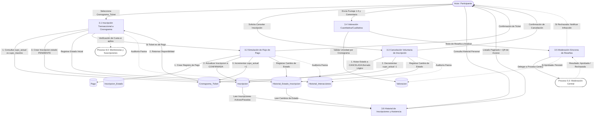

```mermaid
graph TD
    %% --- ENTIDADES EXTERNAS ---
    Part([Actor: Participante])
    P5_Ext([Proceso 5.0: Moderación Central])
    P8_Ext([Proceso 8.0: Membresías y Suscripciones])

    %% --- ALMACENES DE DATOS ---
    subgraph Almacenes [ ]
        style Almacenes fill:none,stroke:none
        D3_Insc[(Inscripcion)]
        D3_Est[(Inscripcion_Estado)]
        D3_Hist[(Historial_Estado_Inscripcion)]
        D3_Tkt[(Cronograma_Ticket)]
        D4_Pago[(Pago)]
        D5_Val[(Valoracion)]
        D6_Logs[(Historial_Interacciones)]
    end

    %% --- SUB-PROCESOS DEL MÓDULO 3 ---
    P3_1[3.1 Inscripción Transaccional a Cronograma]
    P3_2[3.2 Simulación de Flujo de Pago]
    P3_3[3.3 Cancelación Voluntaria de Inscripción]
    P3_4[3.4 Valoración Cuantitativa/Cualitativa]
    P3_5[3.5 Moderación Síncrona de Reseñas]
    P3_6[3.6 Historial de Inscripciones y Asistencia]

    %% --- FLUJOS: RF-3.1 INSCRIPCIÓN ---
    Part -->|Selecciona Cronograma_Ticket| P3_1
    P3_1 -->|1. Consultar cupo_actual vs cupo_maximo| D3_Tkt
    D3_Tkt -->|2. Retornar Disponibilidad| P3_1
    P3_1 -->|3. Crear Inscripcion estado PENDIENTE| D3_Insc
    P3_1 -->|Registrar Estado Inicial| D3_Hist

    %% --- FLUJOS: RF-3.2 PAGO ---
    P3_1 -->|Si Ticket es de Pago| P3_2
    P3_2 -->|1. Crear Registro de Pago| D4_Pago
    P3_2 -->|2. Actualizar Inscripcion a CONFIRMADA| D3_Insc
    P3_2 -->|3. Incrementar cupo_actual +1| D3_Tkt
    P3_2 -->|Registrar Cambio de Estado| D3_Hist
    P3_2 -->|Confirmación de Ticket| Part

    %% --- FLUJOS: RF-3.3 CANCELACIÓN ---
    Part -->|Solicita Cancelar Inscripción| P3_3
    P3_3 -->|1. Mutar Estado a CANCELADA Borrado Lógico| D3_Insc
    P3_3 -->|2. Decrementar cupo_actual -1| D3_Tkt
    P3_3 -->|Registrar Cambio de Estado| D3_Hist
    P3_3 -->|Confirmación de Cancelación| Part

    %% --- FLUJOS: RF-3.4 y RF-3.5 VALORACIÓN ---
    Part -->|Envía Puntaje 1-5 y Comentario| P3_4
    P3_4 -->|Validar Unicidad por Cronograma| D5_Val
    P3_4 -->|Texto de Reseña a Analizar| P3_5
    P3_5 -->|Delegar a Proceso Central| P5_Ext
    P5_Ext -.->|Resultado: Aprobada / Rechazada| P3_5
    P3_5 -.->|Si Aprobada: Persistir| D5_Val
    P3_5 -.->|Si Rechazada: Notificar Infracción| Part

    %% --- FLUJOS: RF-3.6 HISTORIAL ---
    Part -->|Consulta Historial Personal| P3_6
    D3_Insc -->|Leer Inscripciones Activas/Pasadas| P3_6
    D3_Hist -->|Leer Cambios de Estado| P3_6
    P3_6 -->|Listado Paginado + QR de Acceso| Part

    %% --- INTERACCIÓN CON MEMBRESÍAS (Contexto) ---
    P3_1 -.->|Verificación de Cuota si aplica| P8_Ext

    %% --- AUDITORÍA ---
    P3_1 -.->|Auditoría Pasiva| D6_Logs
    P3_2 -.->|Auditoría Pasiva| D6_Logs
    P3_3 -.->|Auditoría Pasiva| D6_Logs

    style P5_Ext fill:#fff,stroke:#333,stroke-dasharray: 5 5
    style P8_Ext fill:#fff,stroke:#333,stroke-dasharray: 5 5
```
