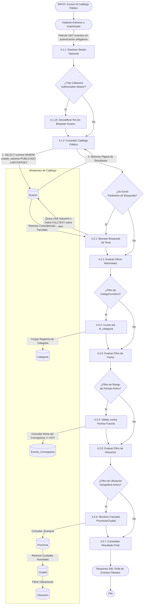

```mermaid
graph TD
    %% Punto de Inicio Único
    INICIO([INICIO: Acceso al Catálogo Público]) --> Vis([Visitante Anónimo o Autenticado])
    Vis -->|Petición GET /eventos sin autenticación obligatoria| P4_1_1[4.1.1: Resolver Sesión Opcional]

    %% Almacenes de Datos
    subgraph Almacenes de Catálogo
        D10_Ev[(Evento)]
        D14_Cat[(Categoria)]
        D11_Cro[(Evento_Cronograma)]
        D21_Ubi[(Ubicacion)]
        D22_Ciu[(Ciudad)]
        D23_Prov[(Provincia)]
    end

    %% 0. SESIÓN OPCIONAL (No bloqueante, distinto de endpoints privados)
    P4_1_1 --> C_TieneJWT{¿Trae Cabecera<br>Authorization Bearer?}
    C_TieneJWT -->|Sí| P4_1_1A[4.1.1A: Decodificar Rol sin Bloquear Acceso]
    C_TieneJWT -->|No| P4_1_2[4.1.2: Consultar Catálogo Público]
    P4_1_1A --> P4_1_2

    %% 1. CATÁLOGO PAGINADO (RF-4.1)
    P4_1_2 -->|1. SELECT eventos WHERE estado_sistema=PUBLICADO LIMIT/OFFSET| D10_Ev
    D10_Ev -->|2. Retornar Página de Resultados| P4_1_2
    P4_1_2 --> C_HayTexto{¿Se Envió<br>Parámetro de Búsqueda?}

    %% 2. BÚSQUEDA PREDICTIVA (RF-4.2)
    C_HayTexto -->|Sí| P4_2_1[4.2.1: Ejecutar Búsqueda de Texto]
    P4_2_1 -->|Query LIKE %texto% o Índice FULLTEXT sobre nombre| D10_Ev
    D10_Ev -->|Retornar Coincidencias Parciales| P4_2_1
    P4_2_1 --> P4_3_1[4.3.1: Evaluar Filtros Adicionales]
    C_HayTexto -->|No| P4_3_1

    %% 3. FILTRADO MULTIVARIABLE (RF-4.3)
    P4_3_1 --> C_FiltroCat{¿Filtro de<br>Categoría Activo?}
    C_FiltroCat -->|Sí| P4_3_2[4.3.2: Cruzar por id_categoria]
    P4_3_2 -->|Cargar Registros de Categoria| D14_Cat
    C_FiltroCat -->|No| P4_3_3[4.3.3: Evaluar Filtro de Fecha]
    P4_3_2 --> P4_3_3

    P4_3_3 --> C_FiltroFecha{¿Filtro de Rango<br>de Fechas Activo?}
    C_FiltroFecha -->|Sí| P4_3_4[4.3.4: Validar contra Fechas Futuras]
    P4_3_4 -->|Consultar fecha del Cronograma >= HOY| D11_Cro
    C_FiltroFecha -->|No| P4_3_5[4.3.5: Evaluar Filtro de Ubicación]
    P4_3_4 --> P4_3_5

    P4_3_5 --> C_FiltroUbi{¿Filtro de Ubicación<br>Geográfica Activo?}
    C_FiltroUbi -->|Sí| P4_3_6[4.3.6: Resolver Cascada Provincia/Ciudad]
    P4_3_6 -->|Consultar Jerarquía| D23_Prov
    D23_Prov -->|Retornar Ciudades Asociadas| D22_Ciu
    D22_Ciu -->|Filtrar Ubicaciones| D21_Ubi
    C_FiltroUbi -->|No| P4_3_7[4.3.7: Consolidar Resultado Final]
    P4_3_6 --> P4_3_7

    P4_3_7 --> Success_Cat([Response 200: Grilla de Eventos Filtrados])

    %% Unificación de Salidas (Punto de Fin Único, sin errores de autenticación por ser público)
    Success_Cat --> FIN([FIN])
```
