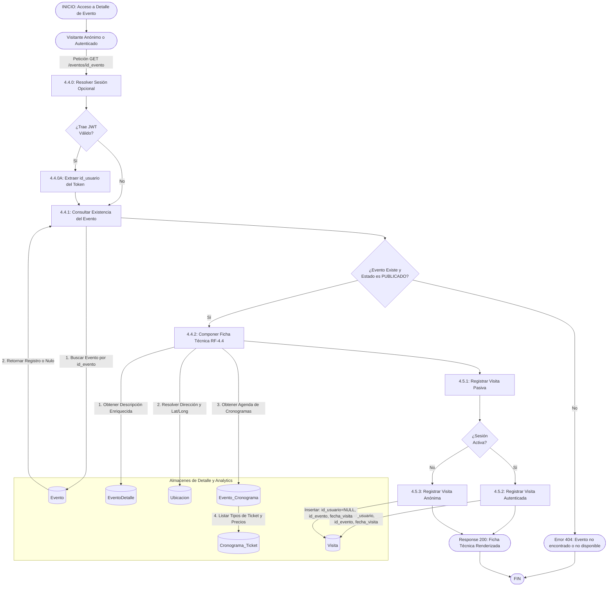

```mermaid
graph TD
    %% Nota: RF-4.5 - Registro Pasivo de Visitas (MVP Simple)
    %% - Sprint 1: Registrar todas las visitas (autenticadas + anónimas)
    %% - Unicidad se calcula en LECTURA (panel: COUNT DISTINCT id_usuario)
    %% - Escalable: Futuro = validar UNIQUE en inserción, separar por plan
    
    INICIO([INICIO: Acceso a Detalle de Evento]) --> Vis([Visitante Anónimo o Autenticado])
    Vis -->|Petición GET /eventos/id_evento| P4_4_0[4.4.0: Resolver Sesión Opcional]

    %% Almacenes de Datos
    subgraph Almacenes de Detalle y Analytics
        D10_Ev[(Evento)]
        D17_Det[(EventoDetalle)]
        D21_Ubi[(Ubicacion)]
        D11_Cro[(Evento_Cronograma)]
        D13_Tkt[(Cronograma_Ticket)]
        D5_Vis[(Visita)]
    end

    %% 0. SESIÓN OPCIONAL
    P4_4_0 --> C_TieneJWT{¿Trae JWT<br>Válido?}
    C_TieneJWT -->|Sí| P4_4_0A[4.4.0A: Extraer id_usuario del Token]
    C_TieneJWT -->|No| P4_4_1[4.4.1: Consultar Existencia del Evento]
    P4_4_0A --> P4_4_1

    %% 1. VALIDACIÓN DE EXISTENCIA Y ESTADO
    P4_4_1 -->|1. Buscar Evento por id_evento| D10_Ev
    D10_Ev -->|2. Retornar Registro o Nulo| P4_4_1
    P4_4_1 --> C_Existe{¿Evento Existe y<br>Estado es PUBLICADO?}
    C_Existe -->|No| Err_404([Error 404: Evento no encontrado o no disponible])
    C_Existe -->|Sí| P4_4_2[4.4.2: Componer Ficha Técnica RF-4.4]

    %% 2. COMPOSICIÓN DE LA FICHA TÉCNICA
    P4_4_2 -->|1. Obtener Descripción Enriquecida| D17_Det
    P4_4_2 -->|2. Resolver Dirección y Lat/Long| D21_Ubi
    P4_4_2 -->|3. Obtener Agenda de Cronogramas| D11_Cro
    D11_Cro -->|4. Listar Tipos de Ticket y Precios| D13_Tkt
    P4_4_2 --> P4_5_1[4.5.1: Registrar Visita Pasiva]

    %% 3. AUDITORÍA DE TRÁFICO (RF-4.5 - Registro Pasivo de Todas las Visitas)
    P4_5_1 --> C_Autenticado{¿Sesión<br>Activa?}
    C_Autenticado -->|Sí| P4_5_2[4.5.2: Registrar Visita Autenticada]
    P4_5_2 -->|Insertar: id_usuario, id_evento, fecha_visita| D5_Vis
    C_Autenticado -->|No| P4_5_3[4.5.3: Registrar Visita Anónima]
    P4_5_3 -->|Insertar: id_usuario=NULL, id_evento, fecha_visita| D5_Vis
    
    P4_5_2 --> Success_Ficha([Response 200: Ficha Técnica Renderizada])
    P4_5_3 --> Success_Ficha

    %% Unificación de Salidas (Punto de Fin Único)
    Err_404 --> FIN([FIN])
    Success_Ficha --> FIN
```
