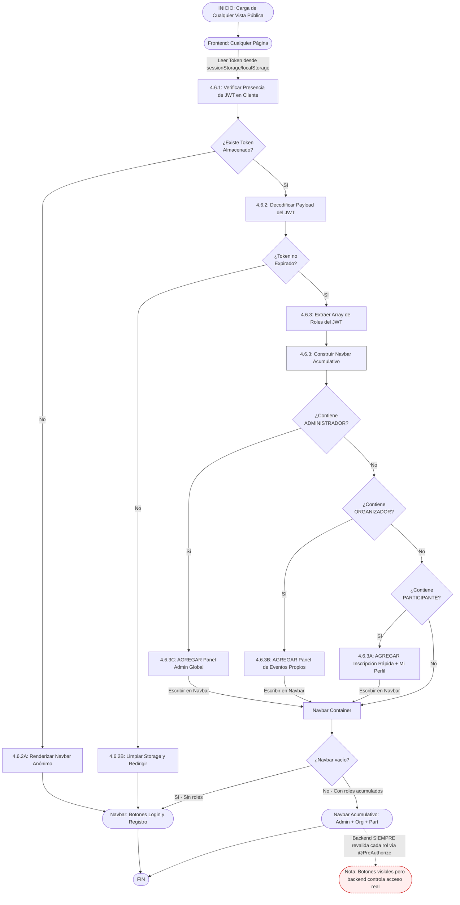

```mermaid
graph TD
    %% Punto de Inicio Único
    INICIO([INICIO: Carga de Cualquier Vista Pública]) --> Cliente([Frontend: Cualquier Página])
    Cliente -->|Leer Token desde sessionStorage/localStorage| P4_6_1[4.6.1: Verificar Presencia de JWT en Cliente]

    %% Nota: Este es un proceso de Frontend (JS Vanilla) apoyado por decodificación local del JWT
    %% IMPORTANTE: Los roles son ACUMULATIVOS (no mutuamente excluyentes). Un Organizador también puede ser Participante.
    P4_6_1 --> C_TieneToken{¿Existe Token<br>Almacenado?}

    %% CAMINO A: SIN SESIÓN
    C_TieneToken -->|No| P4_6_2A[4.6.2A: Renderizar Navbar Anónimo]
    P4_6_2A --> Nav_Anon([Navbar: Botones Login y Registro])

    %% CAMINO B: CON SESIÓN - VALIDAR VIGENCIA
    C_TieneToken -->|Sí| P4_6_2[4.6.2: Decodificar Payload del JWT]
    P4_6_2 --> C_Vigente{¿Token no<br>Expirado?}
    C_Vigente -->|No| P4_6_2B[4.6.2B: Limpiar Storage y Redirigir]
    P4_6_2B --> Nav_Anon

    C_Vigente -->|Sí| P4_6_3[4.6.3: Extraer Array de Roles del JWT]
    P4_6_3 --> P4_6_3_Nav[4.6.3: Construir Navbar Acumulativo]

    %% EVALUACIÓN ACUMULATIVA DE ROLES
    P4_6_3_Nav --> C_Admin{¿Contiene<br>ADMINISTRADOR?}
    C_Admin -->|Sí| P4_6_3C[4.6.3C: AGREGAR Panel Admin Global]
    P4_6_3C -->|Escribir en Navbar| Nav_Container[Navbar Container]
    C_Admin -->|No| C_Org{¿Contiene<br>ORGANIZADOR?}

    C_Org -->|Sí| P4_6_3B[4.6.3B: AGREGAR Panel de Eventos Propios]
    P4_6_3B -->|Escribir en Navbar| Nav_Container
    C_Org -->|No| C_Part{¿Contiene<br>PARTICIPANTE?}

    C_Part -->|Sí| P4_6_3A[4.6.3A: AGREGAR Inscripción Rápida + Mi Perfil]
    P4_6_3A -->|Escribir en Navbar| Nav_Container
    C_Part -->|No| Nav_Container

    %% SALIDAS FINALES (TODAS ACUMULADAS EN UN NAVBAR ÚNICO)
    Nav_Container --> FIN_Navbar{¿Navbar vacío?}
    FIN_Navbar -->|Sí - Sin roles| Nav_Anon
    FIN_Navbar -->|No - Con roles acumulados| Nav_Final([Navbar Acumulativo: Admin + Org + Part])

    %% NOTA DE SEGURIDAD: Esto es UX, no reemplaza RBAC de backend
    Nav_Final -.->|Backend SIEMPRE revalida cada rol vía @PreAuthorize| Nota_RBAC([Nota: Botones visibles pero backend controla acceso real])

    %% Unificación de Salidas (Punto de Fin Único)
    Nav_Anon --> FIN([FIN])
    Nav_Final --> FIN

    style Nota_RBAC fill:#fee,stroke:#c00,stroke-dasharray: 3 3
    style P4_6_3_Nav fill:#eef,stroke:#333
```
