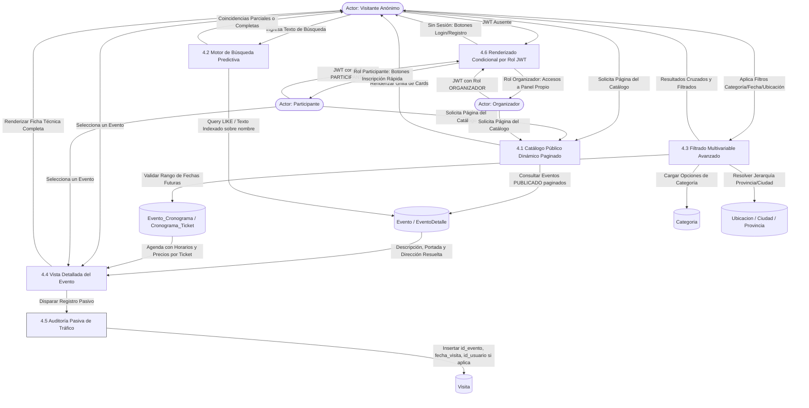

```mermaid
graph TD
    %% --- ENTIDADES EXTERNAS ---
    Anon([Actor: Visitante Anónimo])
    Part([Actor: Participante])
    Org([Actor: Organizador])

    %% --- ALMACENES DE DATOS ---
    subgraph Almacenes [ ]
        style Almacenes fill:none,stroke:none
        D2_Ev[(Evento / EventoDetalle)]
        D2_Cro[(Evento_Cronograma / Cronograma_Ticket)]
        D2_Cat[(Categoria)]
        D2_Ubi[(Ubicacion / Ciudad / Provincia)]
        D5_Vis[(Visita)]
    end

    %% --- SUB-PROCESOS DEL MÓDULO 4 ---
    P4_1[4.1 Catálogo Público Dinámico Paginado]
    P4_2[4.2 Motor de Búsqueda Predictiva]
    P4_3[4.3 Filtrado Multivariable Avanzado]
    P4_4[4.4 Vista Detallada del Evento]
    P4_5[4.5 Auditoría Pasiva de Tráfico]
    P4_6[4.6 Renderizado Condicional por Rol JWT]

    %% --- FLUJOS RF-4.1 CATÁLOGO ---
    Anon -->|Solicita Página del Catálogo| P4_1
    Part -->|Solicita Página del Catálogo| P4_1
    Org -->|Solicita Página del Catálogo| P4_1
    P4_1 -->|Consultar Eventos PUBLICADO paginados| D2_Ev
    P4_1 -->|Renderizar Grilla de Cards| Anon

    %% --- FLUJOS RF-4.2 BÚSQUEDA ---
    Anon -->|Ingresa Texto de Búsqueda| P4_2
    P4_2 -->|Query LIKE / Texto Indexado sobre nombre| D2_Ev
    P4_2 -->|Coincidencias Parciales o Completas| Anon

    %% --- FLUJOS RF-4.3 FILTROS ---
    Anon -->|Aplica Filtros Categoría/Fecha/Ubicación| P4_3
    P4_3 -->|Cargar Opciones de Categoría| D2_Cat
    P4_3 -->|Validar Rango de Fechas Futuras| D2_Cro
    P4_3 -->|Resolver Jerarquía Provincia/Ciudad| D2_Ubi
    P4_3 -->|Resultados Cruzados y Filtrados| Anon

    %% --- FLUJOS RF-4.4 FICHA TÉCNICA ---
    Anon -->|Selecciona un Evento| P4_4
    Part -->|Selecciona un Evento| P4_4
    D2_Ev -->|Descripción, Portada y Dirección Resuelta| P4_4
    D2_Cro -->|Agenda con Horarios y Precios por Ticket| P4_4
    P4_4 -->|Renderizar Ficha Técnica Completa| Anon

    %% --- FLUJOS RF-4.5 VISITAS ---
    P4_4 -->|Disparar Registro Pasivo| P4_5
    P4_5 -->|Insertar id_evento, fecha_visita, id_usuario si aplica| D5_Vis

    %% --- FLUJOS RF-4.6 RENDERIZADO CONDICIONAL ---
    Anon -->|JWT Ausente| P4_6
    Part -->|JWT con Rol PARTICIPANTE| P4_6
    Org -->|JWT con Rol ORGANIZADOR| P4_6
    P4_6 -->|Sin Sesión: Botones Login/Registro| Anon
    P4_6 -->|Rol Participante: Botones Inscripción Rápida| Part
    P4_6 -->|Rol Organizador: Accesos a Panel Propio| Org

    style P4_5 fill:#eef,stroke:#333
```
