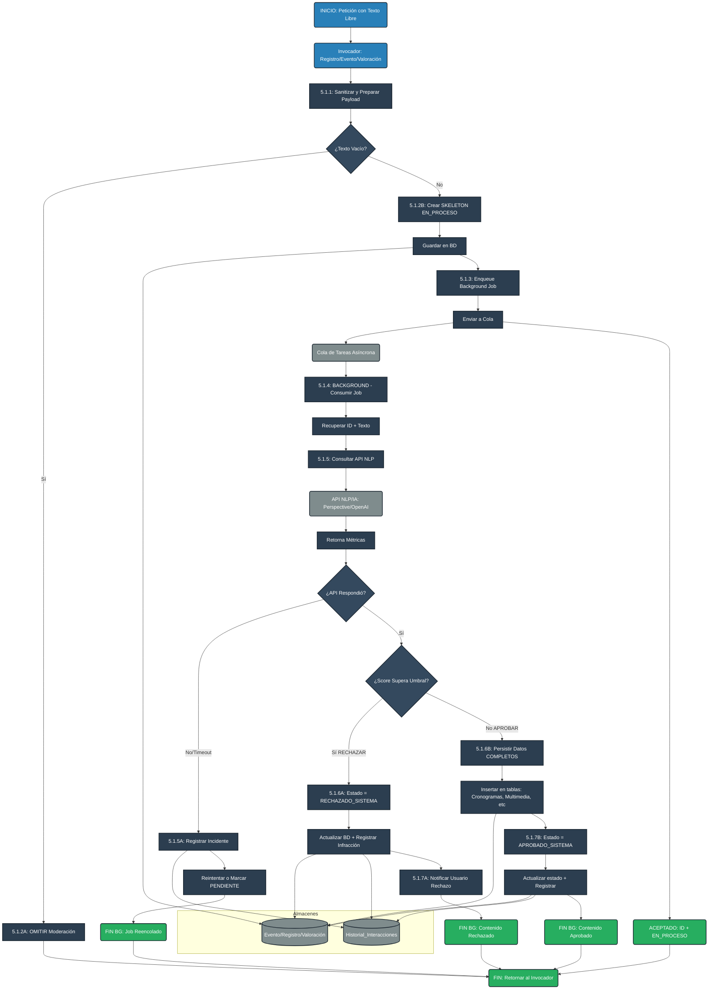

```mermaid
graph TD
    INICIO("INICIO: Petición con Texto Libre") --> Proc("Invocador: Registro/Evento/Valoración")
    Proc --> P5_1_1["5.1.1: Sanitizar y Preparar Payload"]

    subgraph Almacenes["Almacenes"]
        D6_Logs[("Historial_Interacciones")]
        D_Eventos[("Evento/Registro/Valoración")]
    end

    API_NLP("API NLP/IA: Perspective/OpenAI")
    QUEUE("Cola de Tareas Asíncrona")

    P5_1_1 --> C_TextoVacio{"¿Texto Vacío?"}
    
    C_TextoVacio -->|Sí| P5_1_2A["5.1.2A: OMITIR Moderación"]
    C_TextoVacio -->|No| P5_1_2B["5.1.2B: Crear SKELETON EN_PROCESO"]
    
    P5_1_2B --> P5_1_2C["Guardar en BD"]
    P5_1_2C --> D_Eventos
    P5_1_2C --> P5_1_3["5.1.3: Enqueue Background Job"]
    P5_1_3 --> P5_1_3B["Enviar a Cola"]
    P5_1_3B --> QUEUE
    P5_1_3B --> P5_Aceptado("ACEPTADO: ID + EN_PROCESO")
    
    P5_1_2A --> P5_FIN("FIN: Retornar al Invocador")
    P5_Aceptado --> P5_FIN

    QUEUE --> P5_1_4["5.1.4: BACKGROUND - Consumir Job"]
    P5_1_4 --> P5_1_4B["Recuperar ID + Texto"]
    P5_1_4B --> P5_1_5["5.1.5: Consultar API NLP"]
    P5_1_5 --> API_NLP
    API_NLP --> P5_1_5B["Retorna Métricas"]
    P5_1_5B --> C_ApiOk{"¿API Respondió?"}
    
    C_ApiOk -->|No/Timeout| P5_1_5A["5.1.5A: Registrar Incidente"]
    P5_1_5A --> D6_Logs
    P5_1_5A --> P5_1_5C["Reintentar o Marcar PENDIENTE"]
    P5_1_5C --> P5_BG_FIN1("FIN BG: Job Reencolado")
    
    C_ApiOk -->|Sí| C_Umbral{"¿Score Supera Umbral?"}
    
    C_Umbral -->|Sí RECHAZAR| P5_1_6A["5.1.6A: Estado = RECHAZADO_SISTEMA"]
    P5_1_6A --> P5_1_6A_DB["Actualizar BD + Registrar Infracción"]
    P5_1_6A_DB --> D_Eventos
    P5_1_6A_DB --> D6_Logs
    P5_1_6A_DB --> P5_1_7A["5.1.7A: Notificar Usuario Rechazo"]
    P5_1_7A --> P5_BG_FIN2("FIN BG: Contenido Rechazado")
    
    C_Umbral -->|No APROBAR| P5_1_6B["5.1.6B: Persistir Datos COMPLETOS"]
    P5_1_6B --> P5_1_6B_DB["Insertar en tablas: Cronogramas, Multimedia, etc"]
    P5_1_6B_DB --> D_Eventos
    P5_1_6B_DB --> P5_1_7B["5.1.7B: Estado = APROBADO_SISTEMA"]
    P5_1_7B --> P5_1_7B_UPD["Actualizar estado + Registrar"]
    P5_1_7B_UPD --> D_Eventos
    P5_1_7B_UPD --> D6_Logs
    P5_1_7B_UPD --> P5_BG_FIN3("FIN BG: Contenido Aprobado")
    
    P5_BG_FIN1 --> P5_FIN
    P5_BG_FIN2 --> P5_FIN
    P5_BG_FIN3 --> P5_FIN

    classDef procesos fill:#2c3e50,stroke:#1a252f,stroke-width:2px,color:#fff
    classDef decision fill:#34495e,stroke:#1a252f,stroke-width:2px,color:#fff
    classDef almacenes fill:#7f8c8d,stroke:#1a252f,stroke-width:2px,color:#fff
    classDef salida fill:#27ae60,stroke:#1a252f,stroke-width:2px,color:#fff
    classDef inicio fill:#2980b9,stroke:#1a252f,stroke-width:2px,color:#fff

    class P5_1_1,P5_1_2A,P5_1_2B,P5_1_2C,P5_1_3,P5_1_3B,P5_1_4,P5_1_4B,P5_1_5,P5_1_5B,P5_1_5A,P5_1_5C,P5_1_6A,P5_1_6A_DB,P5_1_6B,P5_1_6B_DB,P5_1_7A,P5_1_7B,P5_1_7B_UPD procesos
    class C_TextoVacio,C_ApiOk,C_Umbral decision
    class D6_Logs,D_Eventos,API_NLP,QUEUE almacenes
    class P5_Aceptado,P5_BG_FIN1,P5_BG_FIN2,P5_BG_FIN3,P5_FIN salida
    class INICIO,Proc inicio
```
