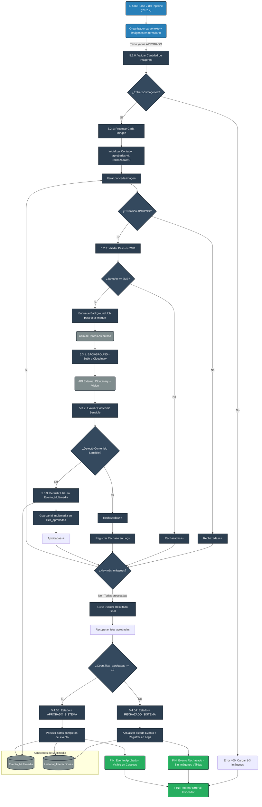

```mermaid
graph TD
    INICIO("INICIO: Fase 2 del Pipeline (RF-2.2)") --> Org("Organizador cargó texto + imágenes en formulario")
    Org -->|Texto ya fue APROBADO| P5_2_0["5.2.0: Validar Cantidad de Imágenes"]

    subgraph Almacenes["Almacenes de Multimedia"]
        D12_Mul[("Evento_Multimedia")]
        D6_Logs[("Historial_Interacciones")]
    end

    Cloudinary("API Externa: Cloudinary + Vision")
    QUEUE("Cola de Tareas Asíncrona")

    P5_2_0 --> C_Cantidad{"¿Entre 1-3 imágenes?"}
    C_Cantidad -->|No| Err_Cantidad("Error 400: Cargar 1-3 imágenes")
    C_Cantidad -->|Sí| P5_2_1["5.2.1: Procesar Cada Imagen"]

    P5_2_1 --> P5_2_1B["Inicializar Contador: aprobadas=0, rechazadas=0"]
    P5_2_1B --> P5_2_2["Iterar por cada imagen"]
    
    P5_2_2 --> C_Formato{"¿Extensión JPG/PNG?"}
    C_Formato -->|No| P5_2_2A["Rechazadas++"]
    C_Formato -->|Sí| P5_2_3["5.2.3: Validar Peso <= 2MB"]

    P5_2_2A --> C_Siguiente{"¿Hay más imágenes?"}
    
    P5_2_3 --> C_Peso{"¿Tamaño <= 2MB?"}
    C_Peso -->|No| P5_2_3A["Rechazadas++"]
    C_Peso -->|Sí| P5_2_4["Enqueue Background Job para esta imagen"]

    P5_2_3A --> C_Siguiente

    P5_2_4 --> QUEUE
    QUEUE --> P5_3_1["5.3.1: BACKGROUND - Subir a Cloudinary"]
    P5_3_1 --> Cloudinary
    Cloudinary --> P5_3_2["5.3.2: Evaluar Contenido Sensible"]
    
    P5_3_2 --> C_Sensible{"¿Detectó Contenido Sensible?"}
    
    C_Sensible -->|Sí| P5_3_2A["Rechazadas++"]
    P5_3_2A --> P5_3_2A_LOG["Registrar Rechazo en Logs"]
    P5_3_2A_LOG --> C_Siguiente
    
    C_Sensible -->|No| P5_3_3["5.3.3: Persistir URL en Evento_Multimedia"]
    P5_3_3 --> D12_Mul
    P5_3_3 --> P5_3_3B["Guardar id_multimedia en lista_aprobadas"]
    P5_3_3B --> P5_3_3C["Aprobadas++"]
    P5_3_3C --> C_Siguiente

    C_Siguiente -->|Sí| P5_2_2
    C_Siguiente -->|No - Todas procesadas| P5_4_0["5.4.0: Evaluar Resultado Final"]
    P5_4_0 --> P5_4_0_CHECK["Recuperar lista_aprobadas"]
    P5_4_0_CHECK --> C_Final{"¿Count lista_aprobadas >= 1?"}
    
    C_Final -->|No| P5_4_0A["5.4.0A: Estado = RECHAZADO_SISTEMA"]
    P5_4_0A --> P5_4_0A_DB["Actualizar estado Evento + Registrar en Logs"]
    P5_4_0A_DB --> D6_Logs
    P5_4_0A_DB --> P5_BG_FIN1("FIN: Evento Rechazado - Sin Imágenes Válidas")
    
    C_Final -->|Sí| P5_4_0B["5.4.0B: Estado = APROBADO_SISTEMA"]
    P5_4_0B --> P5_4_0B_DB["Persistir datos completos del evento"]
    P5_4_0B_DB --> D12_Mul
    P5_4_0B_DB --> D6_Logs
    P5_4_0B_DB --> P5_BG_FIN2("FIN: Evento Aprobado - Visible en Catálogo")

    Err_Cantidad --> P5_FIN("FIN: Retornar Error al Invocador")
    P5_BG_FIN1 --> P5_FIN
    P5_BG_FIN2 --> P5_FIN

    classDef procesos fill:#2c3e50,stroke:#1a252f,stroke-width:2px,color:#fff
    classDef decision fill:#34495e,stroke:#1a252f,stroke-width:2px,color:#fff
    classDef almacenes fill:#7f8c8d,stroke:#1a252f,stroke-width:2px,color:#fff
    classDef salida fill:#27ae60,stroke:#1a252f,stroke-width:2px,color:#fff
    classDef inicio fill:#2980b9,stroke:#1a252f,stroke-width:2px,color:#fff

    class P5_2_0,P5_2_1,P5_2_1B,P5_2_2,P5_2_2A,P5_2_3,P5_2_3A,P5_2_4,P5_3_1,P5_3_2,P5_3_2A,P5_3_2A_LOG,P5_3_3,P5_3_3B,P5_4_0,P5_4_0A,P5_4_0A_DB,P5_4_0B,P5_4_0B_DB procesos
    class C_Cantidad,C_Formato,C_Peso,C_Siguiente,C_Sensible,C_Final decision
    class D12_Mul,D6_Logs,Cloudinary,QUEUE almacenes
    class P5_FIN,P5_BG_FIN1,P5_BG_FIN2 salida
    class INICIO,Org inicio
```
