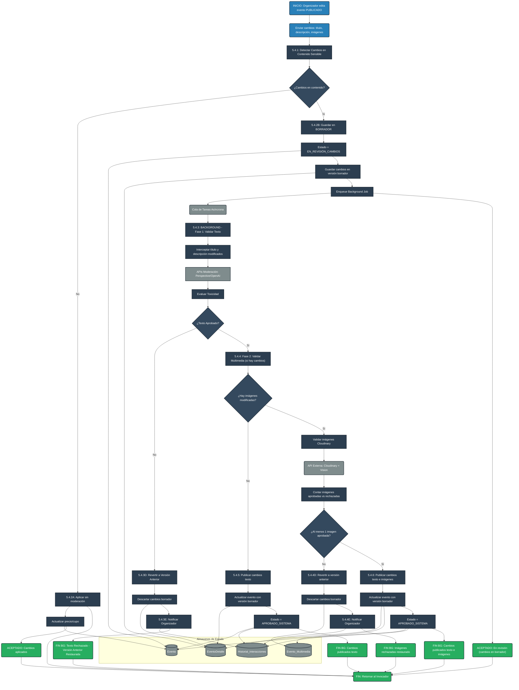

```mermaid
graph TD
    INICIO("INICIO: Organizador edita evento PUBLICADO") --> Org("Enviar cambios: título, descripción, imágenes")
    Org --> P5_4_1["5.4.1: Detectar Cambios en Contenido Sensible"]

    subgraph Almacenes["Almacenes de Estado"]
        D10_Ev[("Evento")]
        D17_Det[("EventoDetalle")]
        D12_Mul[("Evento_Multimedia")]
        D6_Logs[("Historial_Interacciones")]
    end

    Cloudinary("API Externa: Cloudinary + Vision")
    QUEUE("Cola de Tareas Asíncrona")

    P5_4_1 --> C_TieneCambios{"¿Cambios en contenido?"}
    C_TieneCambios -->|No| P5Skip["5.4.2A: Aplicar sin moderación"]
    C_TieneCambios -->|Sí| P5_4_2["5.4.2B: Guardar en BORRADOR"]

    P5Skip --> P5_4_2_SIMPLE["Actualizar precio/cupo"]
    P5_4_2_SIMPLE --> D10_Ev
    P5_4_2_SIMPLE --> P5_Aceptado1("ACEPTADO: Cambios aplicados")

    P5_4_2 --> P5_4_2B["Estado = EN_REVISIÓN_CAMBIOS"]
    P5_4_2B --> D10_Ev
    P5_4_2B --> P5_4_2C["Guardar cambios en versión borrador"]
    P5_4_2C --> D17_Det
    P5_4_2C --> P5_4_2D["Enqueue Background Job"]
    P5_4_2D --> QUEUE
    P5_4_2D --> P5_Aceptado("ACEPTADO: En revisión (cambios en borrador)")

    P5Skip --> P5_FIN("FIN: Retornar al Invocador")
    P5_Aceptado1 --> P5_FIN
    P5_Aceptado --> P5_FIN

    QUEUE --> P5_4_3["5.4.3: BACKGROUND - Fase 1: Validar Texto"]
    P5_4_3 --> P5_4_3B["Interceptar título y descripción modificados"]
    P5_4_3B --> API_Text["APIs Moderación: Perspective/OpenAI"]
    API_Text --> P5_4_3C["Evaluar Toxicidad"]

    P5_4_3C --> C_TextOK{"¿Texto Aprobado?"}

    C_TextOK -->|No| P5_4_3D["5.4.3D: Revertir a Versión Anterior"]
    P5_4_3D --> P5_4_3D_DB["Descartar cambios borrador"]
    P5_4_3D_DB --> D17_Det
    P5_4_3D_DB --> P5_4_3D_NOTIF["5.4.3E: Notificar Organizador"]
    P5_4_3D_NOTIF --> D6_Logs
    P5_4_3D_NOTIF --> P5_BG_FIN1("FIN BG: Texto Rechazado - Versión Anterior Restaurada")

    C_TextOK -->|Sí| P5_4_4["5.4.4: Fase 2: Validar Multimedia (si hay cambios)"]
    P5_4_4 --> C_HayImagenes{"¿Hay imágenes modificadas?"}

    C_HayImagenes -->|No| P5_4_5["5.4.5: Publicar cambios texto"]
    P5_4_5 --> P5_4_5_DB["Actualizar evento con versión borrador"]
    P5_4_5_DB --> D17_Det
    P5_4_5_DB --> P5_4_5_STATE["Estado = APROBADO_SISTEMA"]
    P5_4_5_STATE --> D10_Ev
    P5_4_5_STATE --> D6_Logs
    P5_4_5_STATE --> P5_BG_FIN2("FIN BG: Cambios publicados texto")

    C_HayImagenes -->|Sí| P5_4_4B["Validar imágenes Cloudinary"]
    P5_4_4B --> Cloudinary
    Cloudinary --> P5_4_4C["Contar imágenes aprobadas vs rechazadas"]
    P5_4_4C --> C_ImagenesOK{"¿Al menos 1 imagen aprobada?"}

    C_ImagenesOK -->|No| P5_4_4D["5.4.4D: Revertir a versión anterior"]
    P5_4_4D --> P5_4_4D_DB["Descartar cambios borrador"]
    P5_4_4D_DB --> D12_Mul
    P5_4_4D_DB --> P5_4_4D_NOTIF["5.4.4E: Notificar Organizador"]
    P5_4_4D_NOTIF --> D6_Logs
    P5_4_4D_NOTIF --> P5_BG_FIN3("FIN BG: Imágenes rechazadas restaurado")

    C_ImagenesOK -->|Sí| P5_4_6["5.4.6: Publicar cambios texto e imágenes"]
    P5_4_6 --> P5_4_6_DB["Actualizar evento con versión borrador"]
    P5_4_6_DB --> D17_Det
    P5_4_6_DB --> D12_Mul
    P5_4_6_DB --> P5_4_6_STATE["Estado = APROBADO_SISTEMA"]
    P5_4_6_STATE --> D10_Ev
    P5_4_6_STATE --> D6_Logs
    P5_4_6_STATE --> P5_BG_FIN4("FIN BG: Cambios publicados texto e imágenes")

    P5_BG_FIN1 --> P5_FIN
    P5_BG_FIN2 --> P5_FIN
    P5_BG_FIN3 --> P5_FIN
    P5_BG_FIN4 --> P5_FIN

    classDef procesos fill:#2c3e50,stroke:#1a252f,stroke-width:2px,color:#fff
    classDef decision fill:#34495e,stroke:#1a252f,stroke-width:2px,color:#fff
    classDef almacenes fill:#7f8c8d,stroke:#1a252f,stroke-width:2px,color:#fff
    classDef salida fill:#27ae60,stroke:#1a252f,stroke-width:2px,color:#fff
    classDef inicio fill:#2980b9,stroke:#1a252f,stroke-width:2px,color:#fff

    class P5_4_1,P5_4_2,P5_4_2B,P5_4_2C,P5_4_2D,P5_4_3,P5_4_3B,P5_4_3C,P5_4_3D,P5_4_3D_DB,P5_4_3D_NOTIF,P5_4_4,P5_4_4B,P5_4_4C,P5_4_4D,P5_4_4D_DB,P5_4_4D_NOTIF,P5_4_5,P5_4_5_DB,P5_4_5_STATE,P5_4_6,P5_4_6_DB,P5_4_6_STATE,P5_4_2_SIMPLE,P5Skip procesos
    class C_TieneCambios,C_TextOK,C_HayImagenes,C_ImagenesOK decision
    class D10_Ev,D17_Det,D12_Mul,D6_Logs,Cloudinary,QUEUE,API_Text almacenes
    class P5_FIN,P5_Aceptado,P5_Aceptado1,P5_BG_FIN1,P5_BG_FIN2,P5_BG_FIN3,P5_BG_FIN4 salida
    class INICIO,Org inicio
```
