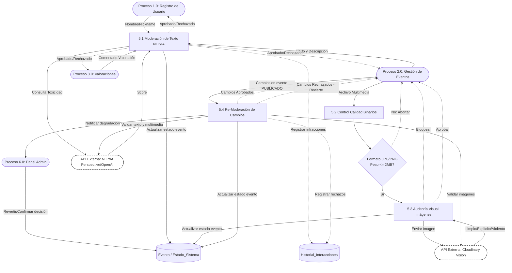

```mermaid
graph TD
    %% --- PROCESOS CLIENTE (INVOCADORES) ---
    P1_Ext([Proceso 1.0: Registro de Usuario])
    P2_Ext([Proceso 2.0: Gestión de Eventos])
    P3_Ext([Proceso 3.0: Valoraciones])
    P6_Ext([Proceso 6.0: Panel Admin])

    %% --- ENTIDADES EXTERNAS DE SERVICIO ---
    API_NLP([API Externa: NLP/IA Perspective/OpenAI])
    Cloudinary([API Externa: Cloudinary Vision])

    %% --- ALMACENES DE DATOS ---
    subgraph Almacenes [ ]
        style Almacenes fill:none,stroke:none
        D10_Ev[(Evento / Estado_Sistema)]
        D6_Logs[(Historial_Interacciones)]
    end

    %% --- SUB-PROCESOS DEL MÓDULO 5 ---
    P5_1[5.1 Moderación de Texto NLP/IA]
    P5_2[5.2 Control Calidad Binarios]
    P5_3[5.3 Auditoría Visual Imágenes]
    P5_4[5.4 Re-Moderación de Cambios]

    %% --- FLUJOS RF-5.1 TEXTO ---
    P1_Ext -->|Nombre/Nickname| P5_1
    P2_Ext -->|Título y Descripción| P5_1
    P3_Ext -->|Comentario Valoración| P5_1
    P5_1 -->|Consulta Toxicidad| API_NLP
    API_NLP -->|Score| P5_1
    P5_1 -.->|Aprobado/Rechazado| P1_Ext
    P5_1 -.->|Aprobado/Rechazado| P2_Ext
    P5_1 -.->|Aprobado/Rechazado| P3_Ext

    %% --- FLUJOS RF-5.2 CONTROL BINARIOS ---
    P2_Ext -->|Archivo Multimedia| P5_2
    P5_2 --> C_Valido{Formato JPG/PNG<br>Peso <= 2MB?}
    C_Valido -.->|No: Abortar| P2_Ext
    C_Valido -->|Sí| P5_3

    %% --- FLUJOS RF-5.3 AUDITORÍA VISUAL ---
    P5_3 -->|Enviar Imagen| Cloudinary
    Cloudinary -->|Limpio/Explícito/Violento| P5_3
    P5_3 -.->|Bloquear| P2_Ext
    P5_3 -.->|Aprobar| P2_Ext

    %% --- FLUJOS RF-5.4 RE-MODERACIÓN DE CAMBIOS ---
    P2_Ext -->|Cambios en evento PUBLICADO| P5_4
    P5_4 -->|Validar texto y multimedia| API_NLP
    P5_4 -->|Validar imágenes| Cloudinary
    P5_4 -.->|Cambios Aprobados| P2_Ext
    P5_4 -.->|Cambios Rechazados - Revierte| P2_Ext
    P5_4 -->|Notificar degradación| P6_Ext
    P6_Ext -->|Revertir/Confirmar decisión| D10_Ev

    %% --- AUDITORÍA GLOBAL ---
    P5_1 -.->|Registrar infracciones| D6_Logs
    P5_4 -.->|Registrar rechazos| D6_Logs
    P5_1 -->|Actualizar estado evento| D10_Ev
    P5_3 -->|Actualizar estado evento| D10_Ev
    P5_4 -->|Actualizar estado evento| D10_Ev

    style API_NLP fill:#fff,stroke:#333,stroke-dasharray: 5 5
    style Cloudinary fill:#fff,stroke:#333,stroke-dasharray: 5 5
```
