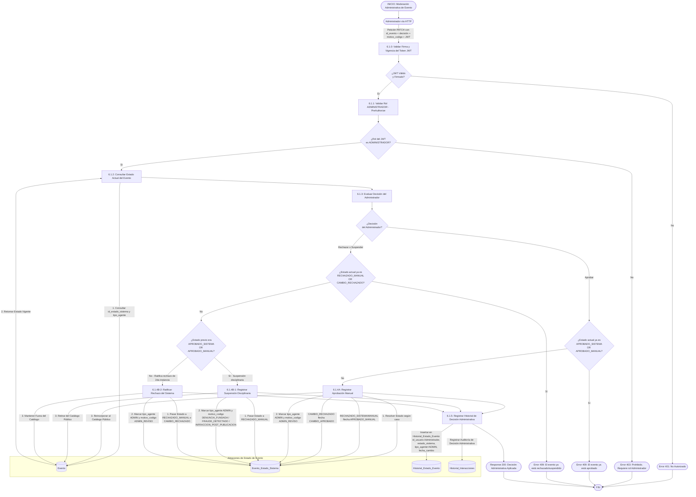

```mermaid
graph TD
    %% Punto de Inicio Único
    INICIO([INICIO: Moderación Administrativa de Evento]) --> Admin([Administrador vía HTTP])
    Admin -->|Petición PATCH con id_evento + decisión + motivo_codigo + JWT| P6_1_0[6.1.0: Validar Firma y Vigencia del Token JWT]

    %% Almacenes de Datos
    subgraph Almacenes de Estado de Evento
        D10_Ev[(Evento)]
        D15_EstSis[(Evento_Estado_Sistema)]
        D19_Hist[(Historial_Estado_Evento)]
        D6_Logs[(Historial_Interacciones)]
    end

    %% 0. AUTENTICACIÓN Y RBAC
    P6_1_0 --> C_Token{¿JWT Válido<br>y Firmado?}
    C_Token -->|No| Err_Auth([Error 401: No Autorizado])
    C_Token -->|Sí| P6_1_1[6.1.1: Validar Rol ADMINISTRADOR - PreAuthorize]

    P6_1_1 --> C_Rol{¿Rol del JWT<br>es ADMINISTRADOR?}
    C_Rol -->|No| Err_Forbidden([Error 403: Prohibido. Requiere rol Administrador])
    C_Rol -->|Sí| P6_1_2[6.1.2: Consultar Estado Actual del Evento]

    %% 1. CONSULTA DE ESTADO (sin precondición de "pendiente de revisión")
    P6_1_2 -->|1. Consultar id_estado_sistema y tipo_agente| D10_Ev
    D10_Ev -->|2. Retornar Estado Vigente| P6_1_2
    P6_1_2 --> P6_1_3[6.1.3: Evaluar Decisión del Administrador]

    %% 2. BIFURCACIÓN DE DECISIÓN
    P6_1_3 --> C_Decision{¿Decisión<br>del Administrador?}

    %% CAMINO A: APROBAR / REVERTIR
    C_Decision -->|Aprobar| C_YaAprobado{¿Estado actual ya es<br>APROBADO_SISTEMA<br>OR APROBADO_MANUAL?}
    C_YaAprobado -->|Sí| Err_YaAprobado([Error 409: El evento ya está aprobado])
    C_YaAprobado -->|No| P6_1_4A[6.1.4A: Registrar Aprobación Manual]
    P6_1_4A -->|1. Resolver Estado según caso| D15_EstSis
    P6_1_4A -->|RECHAZADO_SISTEMA/MANUAL flecha APROBADO_MANUAL| D15_EstSis
    P6_1_4A -->|CAMBIO_RECHAZADO flecha CAMBIO_APROBADO| D15_EstSis
    P6_1_4A -->|2. Marcar tipo_agente ADMIN y motivo_codigo ADMIN_REVISO| D15_EstSis
    P6_1_4A -->|3. Reincorporar al Catálogo Público| D10_Ev

    %% CAMINO B: RECHAZAR / SUSPENDER
    C_Decision -->|Rechazar o Suspender| C_YaRechazado{¿Estado actual ya es<br>RECHAZADO_MANUAL<br>OR CAMBIO_RECHAZADO?}
    C_YaRechazado -->|Sí| Err_YaRechazado([Error 409: El evento ya está rechazado/suspendido])
    C_YaRechazado -->|No| C_OrigenAprobado{¿Estado previo era<br>APROBADO_SISTEMA<br>OR APROBADO_MANUAL?}

    C_OrigenAprobado -->|Sí - Suspensión disciplinaria| P6_1_4B1[6.1.4B-1: Registrar Suspensión Disciplinaria]
    P6_1_4B1 -->|1. Pasar Estado a RECHAZADO_MANUAL| D15_EstSis
    P6_1_4B1 -->|2. Marcar tipo_agente ADMIN y motivo_codigo<br>DENUNCIA_FUNDADA / FRAUDE_DETECTADO /<br>INFRACCION_POST_PUBLICACION| D15_EstSis
    P6_1_4B1 -->|3. Retirar del Catálogo Público| D10_Ev

    C_OrigenAprobado -->|No - Ratifica rechazo de 2da instancia| P6_1_4B2[6.1.4B-2: Ratificar Rechazo del Sistema]
    P6_1_4B2 -->|1. Pasar Estado a RECHAZADO_MANUAL o CAMBIO_RECHAZADO| D15_EstSis
    P6_1_4B2 -->|2. Marcar tipo_agente ADMIN y motivo_codigo ADMIN_REVISO| D15_EstSis
    P6_1_4B2 -->|3. Mantener Fuera del Catálogo| D10_Ev

    P6_1_4A --> P6_1_5[6.1.5: Registrar Historial de Decisión Administrativa]
    P6_1_4B1 --> P6_1_5
    P6_1_4B2 --> P6_1_5
    P6_1_5 -->|Insertar en Historial_Estado_Evento:<br/>id_usuario Administrador, estado_sistema,<br/>tipo_agente=ADMIN, fecha_cambio| D19_Hist
    P6_1_5 -->|Registrar Auditoría de Decisión Administrativa| D6_Logs
    P6_1_5 --> Success_Decision([Response 200: Decisión Administrativa Aplicada])

    %% Unificación de Salidas (Punto de Fin Único)
    Err_Auth --> FIN([FIN])
    Err_Forbidden --> FIN
    Err_YaAprobado --> FIN
    Err_YaRechazado --> FIN
    Success_Decision --> FIN
```
