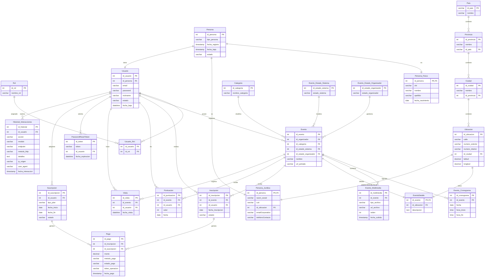

```dbml
Table Persona {
  id_persona int [pk, increment]
  tipo_persona varchar [not null, note: 'fisica / juridica']
  fecha_registro timestamp [not null]
  fecha_baja timestamp
  estado varchar [not null, note: 'activo / inactivo']
}

Table Rol {
  id_rol int [pk, increment]
  nombre_rol varchar [not null, note: 'ORGANIZADOR / PARTICIPANTE']
}

Table Usuario_Rol {
  id_usuario int [ref: > Usuario.id_usuario]
  id_rol int [ref: > Rol.id_rol]
}

Table Persona_Fisica {
  id_persona int [pk, ref: - Persona.id_persona]
  dni varchar [not null]
  nombre varchar [not null]
  apellido varchar [not null]
  fecha_nacimiento date
}

Table Usuario {
  id_usuario int [pk, increment]
  id_persona int [ref: > Persona.id_persona]
  email varchar [not null]
  password varchar [not null]
  nickname varchar [not null]
  estado varchar
  fecha_baja datetime
}

Table Persona_Juridica {
  id_persona int [pk, ref: - Persona.id_persona]
  razon_social varchar [not null]
  cuit varchar [not null]
  id_ubicacion int [ref: > Ubicacion.id_ubicacion, note: 'Vincula al Domicilio Fiscal real mapeado en cascada']
  emailCorporativo varchar [not null]
  telefonoContacto varchar [not null]
}

Table Categoria {
  id_categoria int [pk, increment]
  nombre_categoria varchar [not null]
}

Table Evento {
  id_evento int [pk, increment]
  id_organizador int [ref: > Persona.id_persona]
  id_categoria int [ref: > Categoria.id_categoria]
  id_estado_sistema int [ref: > Evento_Estado_Sistema.id_estado_sistema]
  id_estado_organizador int [ref: > Evento_Estado_Organizador.id_estado_organizador]
  nombre varchar [not null]
  url_portada varchar
}

Table Evento_Cronograma {
  id_cronograma int [pk, increment]
  id_evento int [ref: > Evento.id_evento]
  fecha date [not null]
  hora_inicio time [not null]
  hora_fin time [not null]
}

Table Evento_Multimedia {
  id_multimedia int [pk, increment]
  id_evento int [ref: > Evento.id_evento]
  tipo_archivo varchar [not null, note: 'foto / video']
  url_archivo varchar [not null, note: 'URL del storage (S3, Cloudinary, etc.)']
  orden int [note: 'Para que el organizador elija en qué orden se muestran en el carrusel']
  fecha_subida timestamp [not null] 
}

Table Evento_Estado_Sistema {
  id_estado_sistema int [pk, increment]
  estado_sistema varchar [not null, note: 'aprobado / rechazado / pendiente']
}

Table Evento_Estado_Organizador {
  id_estado_organizador int [pk, increment]
  estado_organizador varchar [not null, note: 'activo / inactivo']
}

Table EventoDetalle {
  id_evento int [pk, ref: - Evento.id_evento]
  id_ubicacion int [ref: > Ubicacion.id_ubicacion]
  descripcion text
  motivo_moderacion text [default: null, note: 'Registra la razón de rechazo dada por el administrador']
}

Table Ubicacion {
  id_ubicacion int [pk, increment]
  calle varchar(150) [not null]
  numero_exterior varchar(20) [not null]
  numero_interior varchar(20) [default: null]
  id_ciudad int [ref: > Ciudad.id_ciudad]    
  latitud decimal(9,6) [default: null]
  longitud decimal(9,6) [default: null]
}

Table Pais {
  id_pais varchar [pk]
  nombre varchar [not null]
}

Table Provincia {
  id_provincia int [pk, increment]
  nombre varchar [not null]
  id_pais varchar [ref: > Pais.id_pais]
}

Table Ciudad {
  id_ciudad int [pk, increment]
  nombre varchar [not null]
  id_provincia int [ref: > Provincia.id_provincia]
}

Table Inscripcion {
  id_inscripcion int [pk, increment]
  id_evento int [ref: > Evento.id_evento]
  id_persona int [ref: > Persona.id_persona]
  fecha_inscripcion date [not null]
  estado varchar [not null, note: 'activa / cancelada']
}

Table Puntuacion {
  id_puntuacion int [pk, increment]
  id_evento int [ref: > Evento.id_evento]
  id_persona int [ref: > Persona.id_persona]
  valor int [not null, note: '1 a 5']
  fecha date [not null]
}

Table Visita {
  id_visita int [pk, increment]
  id_evento int [ref: > Evento.id_evento]
  id_persona int [ref: > Persona.id_persona, null]
  fecha_visita datetime [not null]
}

Table PasswordResetToken {
  id_token int [pk, increment]
  token varchar [not null, unique]
  id_persona int [ref: > Persona.id_persona]
  fecha_expiracion datetime [not null]
}

Table Pago {
  id_pago int [pk, increment]
  id_inscripcion int [ref: > Inscripcion.id_inscripcion, null]
  id_suscripcion int [ref: > Suscripcion.id_suscripcion, null]
  monto decimal(10,2) [not null]
  metodo_pago varchar [not null, note: 'tarjeta / transferencia / mercadopago']
  estado_pago varchar [not null, note: 'pendiente / aprobado / rechazado']
  token_operacion varchar [note: 'ID externo de la pasarela de pago']
  fecha_pago timestamp [not null]
}

Table Suscripcion {
  id_suscripcion int [pk, increment]
  id_persona int [ref: > Persona.id_persona, note: 'Filtro de código: Solo Organizador']
  tipo_plan varchar [not null, note: 'mensual / semestral / anual']
  fecha_inicio date [not null]
  fecha_fin date [not null]
  estado varchar [not null, note: 'activa / expirada / cancelada']
}

Table Historial_Interacciones {
  id_historial int [pk, increment]
  id_persona int [ref: > Persona.id_persona]
  accion varchar [not null, note: 'CREAR / MODIFICAR / ELIMINAR / LEER / LOGIN']
  modulo varchar [not null, note: 'EVENTOS / INSCRIPCIONES / AUTENTICACION']
  endpoint varchar [not null, note: '/api/v1/eventos/guardar']
  metodo_http varchar [not null, note: 'POST / GET / PUT / DELETE']
  detalles text [note: 'Guarda info extra, ej: Se eliminó el evento ID 45']
  ip_origen varchar [note: 'Para rastrear desde dónde operó']
  user_agent varchar [note: 'Dispositivo / Navegador utilizado']
  fecha_interaccion timestamp [not null]
}


