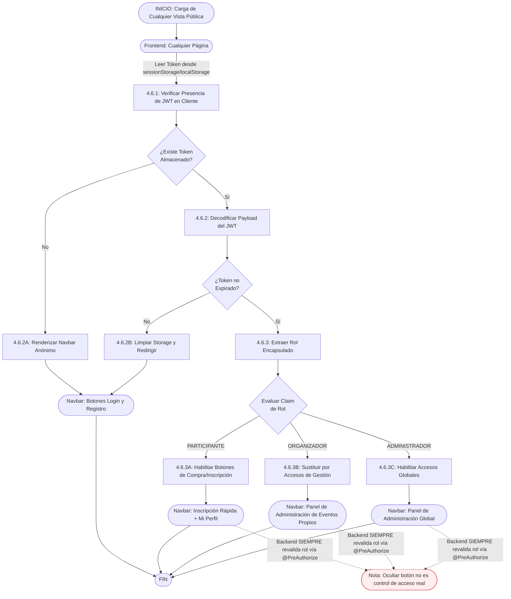

```mermaid
graph TD
    %% Punto de Inicio Único
    INICIO([INICIO: Carga de Cualquier Vista Pública]) --> Cliente([Frontend: Cualquier Página])
    Cliente -->|Leer Token desde sessionStorage/localStorage| P4_6_1[4.6.1: Verificar Presencia de JWT en Cliente]

    %% Nota: Este es un proceso de Frontend (JS Vanilla) apoyado por decodificación local del JWT
    P4_6_1 --> C_TieneToken{¿Existe Token<br>Almacenado?}

    %% CAMINO A: SIN SESIÓN
    C_TieneToken -->|No| P4_6_2A[4.6.2A: Renderizar Navbar Anónimo]
    P4_6_2A --> Nav_Anon([Navbar: Botones Login y Registro])

    %% CAMINO B: CON SESIÓN - VALIDAR VIGENCIA
    C_TieneToken -->|Sí| P4_6_2[4.6.2: Decodificar Payload del JWT]
    P4_6_2 --> C_Vigente{¿Token no<br>Expirado?}
    C_Vigente -->|No| P4_6_2B[4.6.2B: Limpiar Storage y Redirigir]
    P4_6_2B --> Nav_Anon

    C_Vigente -->|Sí| P4_6_3[4.6.3: Extraer Rol Encapsulado]
    P4_6_3 --> C_Rol{Evaluar Claim<br>de Rol}

    %% CAMINO C: ROL PARTICIPANTE
    C_Rol -->|PARTICIPANTE| P4_6_3A[4.6.3A: Habilitar Botones de Compra/Inscripción]
    P4_6_3A --> Nav_Part([Navbar: Inscripción Rápida + Mi Perfil])

    %% CAMINO D: ROL ORGANIZADOR
    C_Rol -->|ORGANIZADOR| P4_6_3B[4.6.3B: Sustituir por Accesos de Gestión]
    P4_6_3B --> Nav_Org([Navbar: Panel de Administración de Eventos Propios])

    %% CAMINO E: ROL ADMINISTRADOR
    C_Rol -->|ADMINISTRADOR| P4_6_3C[4.6.3C: Habilitar Accesos Globales]
    P4_6_3C --> Nav_Admin([Navbar: Panel de Administración Global])

    %% NOTA DE SEGURIDAD: Esto es UX, no reemplaza RBAC de backend
    Nav_Part -.->|Backend SIEMPRE revalida rol vía @PreAuthorize| Nota_RBAC([Nota: Ocultar botón no es control de acceso real])
    Nav_Org -.->|Backend SIEMPRE revalida rol vía @PreAuthorize| Nota_RBAC
    Nav_Admin -.->|Backend SIEMPRE revalida rol vía @PreAuthorize| Nota_RBAC

    %% Unificación de Salidas (Punto de Fin Único)
    Nav_Anon --> FIN([FIN])
    Nav_Part --> FIN
    Nav_Org --> FIN
    Nav_Admin --> FIN

    style Nota_RBAC fill:#fee,stroke:#c00,stroke-dasharray: 3 3
```
