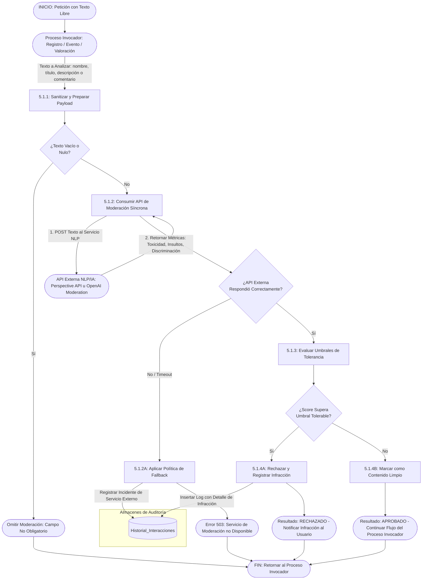

```mermaid
graph TD
    %% Punto de Inicio Único
    INICIO([INICIO: Petición con Texto Libre]) --> Proc([Proceso Invocador: Registro / Evento / Valoración])
    Proc -->|Texto a Analizar: nombre, título, descripción o comentario| P5_1_1[5.1.1: Sanitizar y Preparar Payload]

    %% Almacenes de Datos
    subgraph Almacenes de Auditoría
        D6_Logs[(Historial_Interacciones)]
    end

    API_NLP([API Externa NLP/IA: Perspective API u OpenAI Moderation])

    %% 1. PREPARACIÓN DE LA PETICIÓN
    P5_1_1 --> C_TextoVacio{¿Texto Vacío o<br>Nulo?}
    C_TextoVacio -->|Sí| Skip_Moderacion([Omitir Moderación: Campo No Obligatorio])
    C_TextoVacio -->|No| P5_1_2[5.1.2: Consumir API de Moderación Síncrona]

    %% 2. LLAMADA SÍNCRONA A LA API EXTERNA
    P5_1_2 -->|1. POST Texto al Servicio NLP| API_NLP
    API_NLP -->|2. Retornar Métricas: Toxicidad, Insultos, Discriminación| P5_1_2

    P5_1_2 --> C_ApiDisponible{¿API Externa<br>Respondió Correctamente?}

    %% CAMINO DE FALLBACK: API CAÍDA
    C_ApiDisponible -->|No / Timeout| P5_1_2A[5.1.2A: Aplicar Política de Fallback]
    P5_1_2A -->|Registrar Incidente de Servicio Externo| D6_Logs
    P5_1_2A --> Err_ServicioCaido([Error 503: Servicio de Moderación no Disponible])

    %% CAMINO NORMAL: API RESPONDE
    C_ApiDisponible -->|Sí| P5_1_3[5.1.3: Evaluar Umbrales de Tolerancia]
    P5_1_3 --> C_Umbral{¿Score Supera<br>Umbral Tolerable?}

    %% RECHAZO
    C_Umbral -->|Sí| P5_1_4A[5.1.4A: Rechazar y Registrar Infracción]
    P5_1_4A -->|Insertar Log con Detalle de Infracción| D6_Logs
    P5_1_4A --> Rechazado([Resultado: RECHAZADO - Notificar Infracción al Usuario])

    %% APROBACIÓN
    C_Umbral -->|No| P5_1_4B[5.1.4B: Marcar como Contenido Limpio]
    P5_1_4B --> Aprobado([Resultado: APROBADO - Continuar Flujo del Proceso Invocador])

    %% Unificación de Salidas (Punto de Fin Único)
    Skip_Moderacion --> FIN([FIN: Retornar al Proceso Invocador])
    Err_ServicioCaido --> FIN
    Rechazado --> FIN
    Aprobado --> FIN
```
