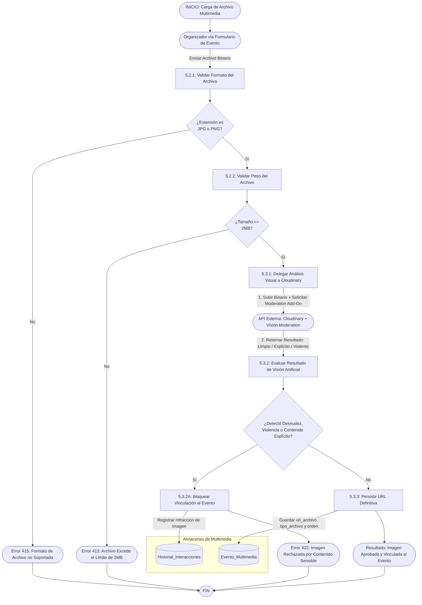

```mermaid
graph TD
    %% Punto de Inicio Único
    INICIO([INICIO: Carga de Archivo Multimedia]) --> Org([Organizador vía Formulario de Evento])
    Org -->|Enviar Archivo Binario| P5_2_1[5.2.1: Validar Formato del Archivo]

    %% Almacenes de Datos
    subgraph Almacenes de Multimedia
        D12_Mul[(Evento_Multimedia)]
        D6_Logs[(Historial_Interacciones)]
    end

    Cloudinary([API Externa: Cloudinary + Vision Moderation])

    %% 1. VALIDACIÓN DE FORMATO (RF-5.2, Barrera Perimetral Local)
    P5_2_1 --> C_Formato{¿Extensión es<br>JPG o PNG?}
    C_Formato -->|No| Err_Formato([Error 415: Formato de Archivo no Soportado])
    C_Formato -->|Sí| P5_2_2[5.2.2: Validar Peso del Archivo]

    %% 2. VALIDACIÓN DE TAMAÑO (Antes de Consumir Red)
    P5_2_2 --> C_Peso{¿Tamaño <=<br>2MB?}
    C_Peso -->|No| Err_Peso([Error 413: Archivo Excede el Límite de 2MB])
    C_Peso -->|Sí| P5_3_1[5.3.1: Delegar Análisis Visual a Cloudinary]

    %% 3. AUDITORÍA VISUAL EXTERNA (RF-5.3)
    P5_3_1 -->|1. Subir Binario + Solicitar Moderation Add-On| Cloudinary
    Cloudinary -->|2. Retornar Resultado: Limpio / Explícito / Violento| P5_3_2[5.3.2: Evaluar Resultado de Visión Artificial]

    P5_3_2 --> C_Sensible{¿Detectó Desnudez,<br>Violencia o Contenido Explícito?}

    %% CAMINO A: IMAGEN RECHAZADA
    C_Sensible -->|Sí| P5_3_2A[5.3.2A: Bloquear Vinculación al Evento]
    P5_3_2A -->|Registrar Infracción de Imagen| D6_Logs
    P5_3_2A --> Err_Sensible([Error 422: Imagen Rechazada por Contenido Sensible])

    %% CAMINO B: IMAGEN APROBADA
    C_Sensible -->|No| P5_3_3[5.3.3: Persistir URL Definitiva]
    P5_3_3 -->|Guardar url_archivo, tipo_archivo y orden| D12_Mul
    P5_3_3 --> Success_Img([Resultado: Imagen Aprobada y Vinculada al Evento])

    %% Unificación de Salidas (Punto de Fin Único)
    Err_Formato --> FIN([FIN])
    Err_Peso --> FIN
    Err_Sensible --> FIN
    Success_Img --> FIN
```
