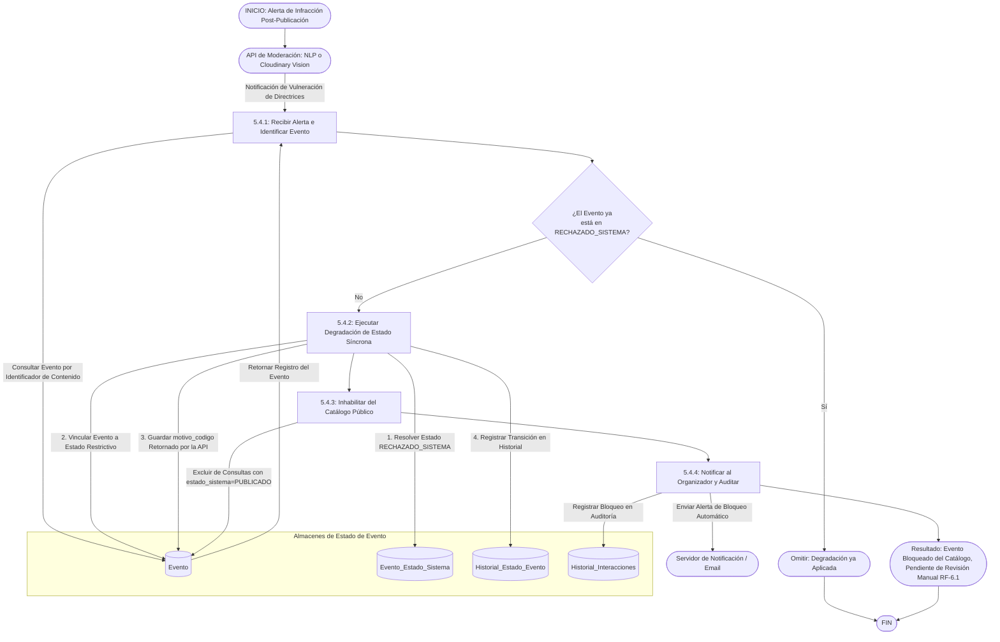

```mermaid
graph TD
    %% Punto de Inicio Único
    INICIO([INICIO: Alerta de Infracción Post-Publicación]) --> API_Ext([API de Moderación: NLP o Cloudinary Vision])
    API_Ext -->|Notificación de Vulneración de Directrices| P5_4_1[5.4.1: Recibir Alerta e Identificar Evento]

    %% Almacenes de Datos
    subgraph Almacenes de Estado de Evento
        D10_Ev[(Evento)]
        D15_EstSis[(Evento_Estado_Sistema)]
        D19_Hist[(Historial_Estado_Evento)]
        D6_Logs[(Historial_Interacciones)]
    end

    Email_Sys([Servidor de Notificación / Email])

    %% 1. IDENTIFICACIÓN DEL EVENTO AFECTADO
    P5_4_1 -->|Consultar Evento por Identificador de Contenido| D10_Ev
    D10_Ev -->|Retornar Registro del Evento| P5_4_1
    P5_4_1 --> C_YaRechazado{¿El Evento ya<br>está en RECHAZADO_SISTEMA?}
    C_YaRechazado -->|Sí| Skip_Duplicado([Omitir: Degradación ya Aplicada])
    C_YaRechazado -->|No| P5_4_2[5.4.2: Ejecutar Degradación de Estado Síncrona]

    %% 2. MUTACIÓN DE ESTADO (NO BORRADO FÍSICO)
    P5_4_2 -->|1. Resolver Estado RECHAZADO_SISTEMA| D15_EstSis
    P5_4_2 -->|2. Vincular Evento a Estado Restrictivo| D10_Ev
    P5_4_2 -->|3. Guardar motivo_codigo Retornado por la API| D10_Ev
    P5_4_2 -->|4. Registrar Transición en Historial| D19_Hist

    P5_4_2 --> P5_4_3[5.4.3: Inhabilitar del Catálogo Público]
    P5_4_3 -->|Excluir de Consultas con estado_sistema=PUBLICADO| D10_Ev

    P5_4_3 --> P5_4_4[5.4.4: Notificar al Organizador y Auditar]
    P5_4_4 -->|Enviar Alerta de Bloqueo Automático| Email_Sys
    P5_4_4 -->|Registrar Bloqueo en Auditoría| D6_Logs
    P5_4_4 --> Success_Degradado([Resultado: Evento Bloqueado del Catálogo, Pendiente de Revisión Manual RF-6.1])

    %% Unificación de Salidas (Punto de Fin Único)
    Skip_Duplicado --> FIN([FIN])
    Success_Degradado --> FIN
```
