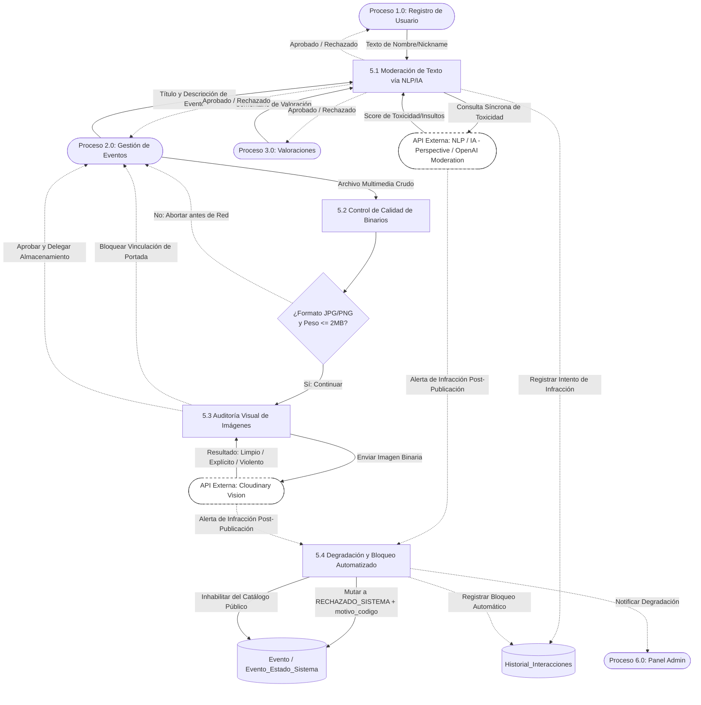

```mermaid
graph TD
    %% --- PROCESOS CLIENTE (INVOCADORES) ---
    P1_Ext([Proceso 1.0: Registro de Usuario])
    P2_Ext([Proceso 2.0: Gestión de Eventos])
    P3_Ext([Proceso 3.0: Valoraciones])
    P6_Ext([Proceso 6.0: Panel Admin])

    %% --- ENTIDADES EXTERNAS DE SERVICIO ---
    API_NLP([API Externa: NLP / IA - Perspective / OpenAI Moderation])
    Cloudinary([API Externa: Cloudinary Vision])

    %% --- ALMACENES DE DATOS ---
    subgraph Almacenes [ ]
        style Almacenes fill:none,stroke:none
        D10_Ev[(Evento / Evento_Estado_Sistema)]
        D6_Logs[(Historial_Interacciones)]
    end

    %% --- SUB-PROCESOS DEL MÓDULO 5 ---
    P5_1[5.1 Moderación de Texto vía NLP/IA]
    P5_2[5.2 Control de Calidad de Binarios]
    P5_3[5.3 Auditoría Visual de Imágenes]
    P5_4[5.4 Degradación y Bloqueo Automatizado]

    %% --- FLUJOS RF-5.1 TEXTO ---
    P1_Ext -->|Texto de Nombre/Nickname| P5_1
    P2_Ext -->|Título y Descripción de Evento| P5_1
    P3_Ext -->|Comentario de Valoración| P5_1
    P5_1 -->|Consulta Síncrona de Toxicidad| API_NLP
    API_NLP -->|Score de Toxicidad/Insultos| P5_1
    P5_1 -.->|Aprobado / Rechazado| P1_Ext
    P5_1 -.->|Aprobado / Rechazado| P2_Ext
    P5_1 -.->|Aprobado / Rechazado| P3_Ext

    %% --- FLUJOS RF-5.2 CONTROL BINARIOS ---
    P2_Ext -->|Archivo Multimedia Crudo| P5_2
    P5_2 --> C_Valido{¿Formato JPG/PNG<br>y Peso <= 2MB?}
    C_Valido -.->|No: Abortar antes de Red| P2_Ext
    C_Valido -->|Sí: Continuar| P5_3

    %% --- FLUJOS RF-5.3 AUDITORÍA VISUAL ---
    P5_3 -->|Enviar Imagen Binaria| Cloudinary
    Cloudinary -->|Resultado: Limpio / Explícito / Violento| P5_3
    P5_3 -.->|Bloquear Vinculación de Portada| P2_Ext
    P5_3 -.->|Aprobar y Delegar Almacenamiento| P2_Ext

    %% --- FLUJOS RF-5.4 DEGRADACIÓN AUTOMÁTICA ---
    API_NLP -.->|Alerta de Infracción Post-Publicación| P5_4
    Cloudinary -.->|Alerta de Infracción Post-Publicación| P5_4
    P5_4 -->|Mutar a RECHAZADO_SISTEMA + motivo_codigo| D10_Ev
    P5_4 -->|Inhabilitar del Catálogo Público| D10_Ev
    P5_4 -.->|Notificar Degradación| P6_Ext

    %% --- AUDITORÍA GLOBAL ---
    P5_1 -.->|Registrar Intento de Infracción| D6_Logs
    P5_4 -.->|Registrar Bloqueo Automático| D6_Logs

    style API_NLP fill:#fff,stroke:#333,stroke-dasharray: 5 5
    style Cloudinary fill:#fff,stroke:#333,stroke-dasharray: 5 5
```
