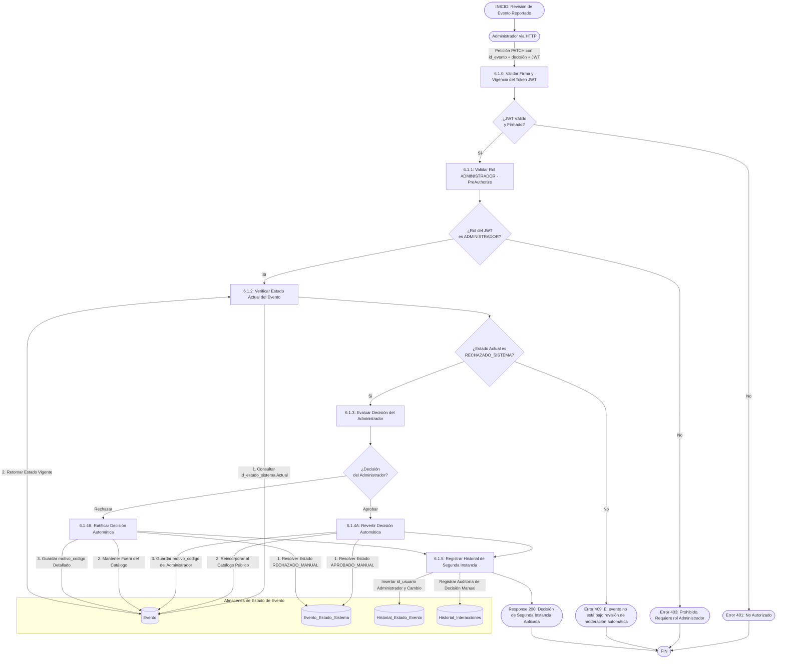

```mermaid
graph TD
    %% Punto de Inicio Único
    INICIO([INICIO: Revisión de Evento Reportado]) --> Admin([Administrador vía HTTP])
    Admin -->|Petición PATCH con id_evento + decisión + JWT| P6_1_0[6.1.0: Validar Firma y Vigencia del Token JWT]

    %% Almacenes de Datos
    subgraph Almacenes de Estado de Evento
        D10_Ev[(Evento)]
        D15_EstSis[(Evento_Estado_Sistema)]
        D19_Hist[(Historial_Estado_Evento)]
        D6_Logs[(Historial_Interacciones)]
    end

    %% 0. AUTENTICACIÓN Y RBAC
    P6_1_0 --> C_Token{¿JWT Válido<br>y Firmado?}
    C_Token -->|No| Err_Auth([Error 401: No Autorizado])
    C_Token -->|Sí| P6_1_1[6.1.1: Validar Rol ADMINISTRADOR - PreAuthorize]

    P6_1_1 --> C_Rol{¿Rol del JWT<br>es ADMINISTRADOR?}
    C_Rol -->|No| Err_Forbidden([Error 403: Prohibido. Requiere rol Administrador])
    C_Rol -->|Sí| P6_1_2[6.1.2: Verificar Estado Actual del Evento]

    %% 1. VALIDACIÓN DE PRECONDICIÓN
    P6_1_2 -->|1. Consultar id_estado_sistema Actual| D10_Ev
    D10_Ev -->|2. Retornar Estado Vigente| P6_1_2
    P6_1_2 --> C_EsRechazado{¿Estado Actual es<br>RECHAZADO_SISTEMA?}
    C_EsRechazado -->|No| Err_NoAplica([Error 409: El evento no está bajo revisión de moderación automática])
    C_EsRechazado -->|Sí| P6_1_3[6.1.3: Evaluar Decisión del Administrador]

    %% 2. BIFURCACIÓN DE DECISIÓN MANUAL
    P6_1_3 --> C_Decision{¿Decisión<br>del Administrador?}

    %% CAMINO A: APROBAR MANUALMENTE (Revertir IA)
    C_Decision -->|Aprobar| P6_1_4A[6.1.4A: Revertir Decisión Automática]
    P6_1_4A -->|1. Resolver Estado APROBADO_MANUAL| D15_EstSis
    P6_1_4A -->|2. Reincorporar al Catálogo Público| D10_Ev
    P6_1_4A -->|3. Guardar motivo_codigo del Administrador| D10_Ev

    %% CAMINO B: RATIFICAR RECHAZO
    C_Decision -->|Rechazar| P6_1_4B[6.1.4B: Ratificar Decisión Automática]
    P6_1_4B -->|1. Resolver Estado RECHAZADO_MANUAL| D15_EstSis
    P6_1_4B -->|2. Mantener Fuera del Catálogo| D10_Ev
    P6_1_4B -->|3. Guardar motivo_codigo Detallado| D10_Ev

    P6_1_4A --> P6_1_5[6.1.5: Registrar Historial de Segunda Instancia]
    P6_1_4B --> P6_1_5
    P6_1_5 -->|Insertar id_usuario Administrador y Cambio| D19_Hist
    P6_1_5 -->|Registrar Auditoría de Decisión Manual| D6_Logs
    P6_1_5 --> Success_Decision([Response 200: Decisión de Segunda Instancia Aplicada])

    %% Unificación de Salidas (Punto de Fin Único)
    Err_Auth --> FIN([FIN])
    Err_Forbidden --> FIN
    Err_NoAplica --> FIN
    Success_Decision --> FIN
```
