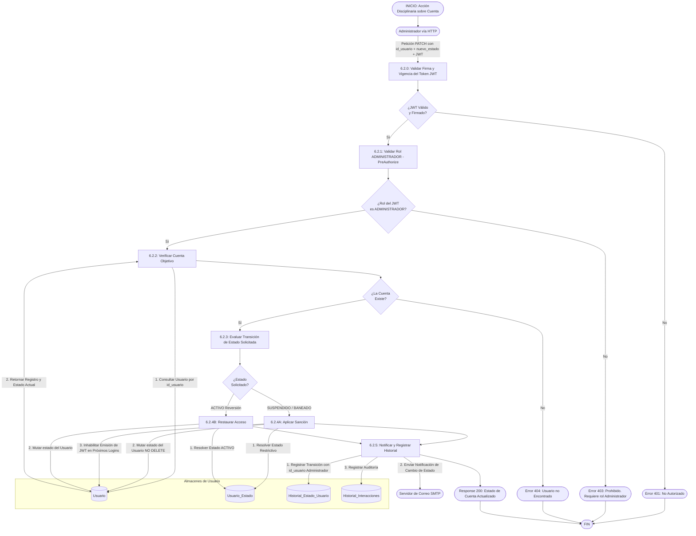

```mermaid
graph TD
    %% Punto de Inicio Único
    INICIO([INICIO: Acción Disciplinaria sobre Cuenta]) --> Admin([Administrador vía HTTP])
    Admin -->|Petición PATCH con id_usuario + nuevo_estado + JWT| P6_2_0[6.2.0: Validar Firma y Vigencia del Token JWT]

    %% Almacenes de Datos
    subgraph Almacenes de Usuario
        D1_Usr[(Usuario)]
        D1_UsrEst[(Usuario_Estado)]
        D1_Hist[(Historial_Estado_Usuario)]
        D6_Logs[(Historial_Interacciones)]
    end

    Email_Sys([Servidor de Correo SMTP])

    %% 0. AUTENTICACIÓN Y RBAC
    P6_2_0 --> C_Token{¿JWT Válido<br>y Firmado?}
    C_Token -->|No| Err_Auth([Error 401: No Autorizado])
    C_Token -->|Sí| P6_2_1[6.2.1: Validar Rol ADMINISTRADOR - PreAuthorize]

    P6_2_1 --> C_Rol{¿Rol del JWT<br>es ADMINISTRADOR?}
    C_Rol -->|No| Err_Forbidden([Error 403: Prohibido. Requiere rol Administrador])
    C_Rol -->|Sí| P6_2_2[6.2.2: Verificar Cuenta Objetivo]

    %% 1. VALIDACIÓN DE PRECONDICIÓN
    P6_2_2 -->|1. Consultar Usuario por id_usuario| D1_Usr
    D1_Usr -->|2. Retornar Registro y Estado Actual| P6_2_2
    P6_2_2 --> C_Existe{¿La Cuenta<br>Existe?}
    C_Existe -->|No| Err_404([Error 404: Usuario no Encontrado])
    C_Existe -->|Sí| P6_2_3[6.2.3: Evaluar Transición de Estado Solicitada]

    %% 2. BIFURCACIÓN DE ESTADOS
    P6_2_3 --> C_NuevoEstado{¿Estado<br>Solicitado?}

    C_NuevoEstado -->|SUSPENDIDO / BANEADO| P6_2_4A[6.2.4A: Aplicar Sanción]
    P6_2_4A -->|1. Resolver Estado Restrictivo| D1_UsrEst
    P6_2_4A -->|2. Mutar estado del Usuario NO DELETE| D1_Usr
    P6_2_4A -->|3. Inhabilitar Emisión de JWT en Próximos Logins| D1_Usr
    P6_2_4A --> P6_2_5[6.2.5: Notificar y Registrar Historial]

    C_NuevoEstado -->|ACTIVO Reversión| P6_2_4B[6.2.4B: Restaurar Acceso]
    P6_2_4B -->|1. Resolver Estado ACTIVO| D1_UsrEst
    P6_2_4B -->|2. Mutar estado del Usuario| D1_Usr
    P6_2_4B --> P6_2_5

    %% 3. NOTIFICACIÓN Y AUDITORÍA
    P6_2_5 -->|1. Registrar Transición con id_usuario Administrador| D1_Hist
    P6_2_5 -->|2. Enviar Notificación de Cambio de Estado| Email_Sys
    P6_2_5 -->|3. Registrar Auditoría| D6_Logs
    P6_2_5 --> Success_Cambio([Response 200: Estado de Cuenta Actualizado])

    %% Unificación de Salidas (Punto de Fin Único)
    Err_Auth --> FIN([FIN])
    Err_Forbidden --> FIN
    Err_404 --> FIN
    Success_Cambio --> FIN
```
