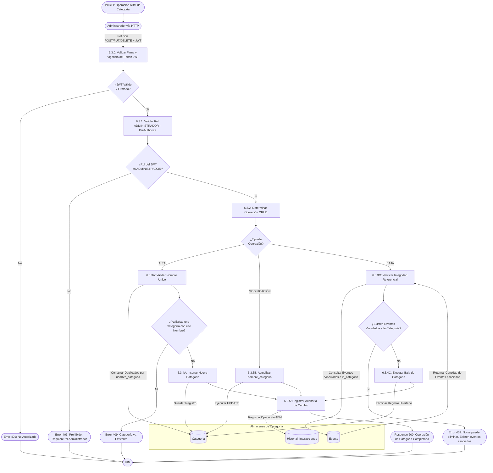

```mermaid
graph TD
    %% Punto de Inicio Único
    INICIO([INICIO: Operación ABM de Categoría]) --> Admin([Administrador vía HTTP])
    Admin -->|Petición POST/PUT/DELETE + JWT| P6_3_0[6.3.0: Validar Firma y Vigencia del Token JWT]

    %% Almacenes de Datos
    subgraph Almacenes de Categoría
        D14_Cat[(Categoria)]
        D10_Ev[(Evento)]
        D6_Logs[(Historial_Interacciones)]
    end

    %% 0. AUTENTICACIÓN Y RBAC
    P6_3_0 --> C_Token{¿JWT Válido<br>y Firmado?}
    C_Token -->|No| Err_Auth([Error 401: No Autorizado])
    C_Token -->|Sí| P6_3_1[6.3.1: Validar Rol ADMINISTRADOR - PreAuthorize]

    P6_3_1 --> C_Rol{¿Rol del JWT<br>es ADMINISTRADOR?}
    C_Rol -->|No| Err_Forbidden([Error 403: Prohibido. Requiere rol Administrador])
    C_Rol -->|Sí| P6_3_2[6.3.2: Determinar Operación CRUD]

    P6_3_2 --> C_Operacion{¿Tipo de<br>Operación?}

    %% CAMINO A: ALTA
    C_Operacion -->|ALTA| P6_3_3A[6.3.3A: Validar Nombre Único]
    P6_3_3A -->|Consultar Duplicados por nombre_categoria| D14_Cat
    P6_3_3A --> C_Duplicado{¿Ya Existe una<br>Categoría con ese Nombre?}
    C_Duplicado -->|Sí| Err_Duplicado([Error 409: Categoría ya Existente])
    C_Duplicado -->|No| P6_3_4A[6.3.4A: Insertar Nueva Categoría]
    P6_3_4A -->|Guardar Registro| D14_Cat

    %% CAMINO B: MODIFICACIÓN
    C_Operacion -->|MODIFICACIÓN| P6_3_3B[6.3.3B: Actualizar nombre_categoria]
    P6_3_3B -->|Ejecutar UPDATE| D14_Cat

    %% CAMINO C: BAJA (CON INTEGRIDAD REFERENCIAL)
    C_Operacion -->|BAJA| P6_3_3C[6.3.3C: Verificar Integridad Referencial]
    P6_3_3C -->|Consultar Eventos Vinculados a id_categoria| D10_Ev
    D10_Ev -->|Retornar Cantidad de Eventos Asociados| P6_3_3C
    P6_3_3C --> C_TieneEventos{¿Existen Eventos<br>Vinculados a la Categoría?}
    C_TieneEventos -->|Sí| Err_Integridad([Error 409: No se puede eliminar. Existen eventos asociados])
    C_TieneEventos -->|No| P6_3_4C[6.3.4C: Ejecutar Baja de Categoría]
    P6_3_4C -->|Eliminar Registro Huérfano| D14_Cat

    P6_3_4A --> P6_3_5[6.3.5: Registrar Auditoría de Cambio]
    P6_3_3B --> P6_3_5
    P6_3_4C --> P6_3_5
    P6_3_5 -->|Registrar Operación ABM| D6_Logs
    P6_3_5 --> Success_ABM([Response 200: Operación de Categoría Completada])

    %% Unificación de Salidas (Punto de Fin Único)
    Err_Auth --> FIN([FIN])
    Err_Forbidden --> FIN
    Err_Duplicado --> FIN
    Err_Integridad --> FIN
    Success_ABM --> FIN
```
