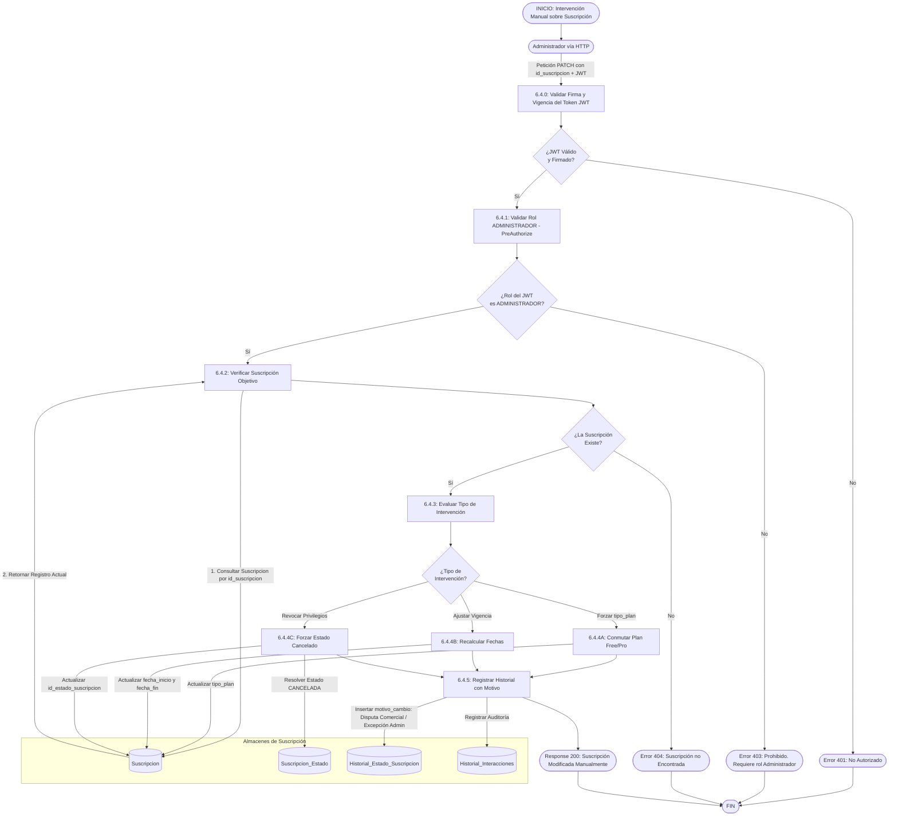

```mermaid
graph TD
    %% Punto de Inicio Único
    INICIO([INICIO: Intervención Manual sobre Suscripción]) --> Admin([Administrador vía HTTP])
    Admin -->|Petición PATCH con id_suscripcion + JWT| P6_4_0[6.4.0: Validar Firma y Vigencia del Token JWT]

    %% Almacenes de Datos
    subgraph Almacenes de Suscripción
        D20_Sus[(Suscripcion)]
        D20_SusEst[(Suscripcion_Estado)]
        D20_Hist[(Historial_Estado_Suscripcion)]
        D6_Logs[(Historial_Interacciones)]
    end

    %% 0. AUTENTICACIÓN Y RBAC
    P6_4_0 --> C_Token{¿JWT Válido<br>y Firmado?}
    C_Token -->|No| Err_Auth([Error 401: No Autorizado])
    C_Token -->|Sí| P6_4_1[6.4.1: Validar Rol ADMINISTRADOR - PreAuthorize]

    P6_4_1 --> C_Rol{¿Rol del JWT<br>es ADMINISTRADOR?}
    C_Rol -->|No| Err_Forbidden([Error 403: Prohibido. Requiere rol Administrador])
    C_Rol -->|Sí| P6_4_2[6.4.2: Verificar Suscripción Objetivo]

    P6_4_2 -->|1. Consultar Suscripcion por id_suscripcion| D20_Sus
    D20_Sus -->|2. Retornar Registro Actual| P6_4_2
    P6_4_2 --> C_Existe{¿La Suscripción<br>Existe?}
    C_Existe -->|No| Err_404([Error 404: Suscripción no Encontrada])
    C_Existe -->|Sí| P6_4_3[6.4.3: Evaluar Tipo de Intervención]

    %% BIFURCACIÓN DE ACCIONES ADMINISTRATIVAS
    P6_4_3 --> C_Accion{¿Tipo de<br>Intervención?}

    C_Accion -->|Forzar tipo_plan| P6_4_4A[6.4.4A: Conmutar Plan Free/Pro]
    P6_4_4A -->|Actualizar tipo_plan| D20_Sus

    C_Accion -->|Ajustar Vigencia| P6_4_4B[6.4.4B: Recalcular Fechas]
    P6_4_4B -->|Actualizar fecha_inicio y fecha_fin| D20_Sus

    C_Accion -->|Revocar Privilegios| P6_4_4C[6.4.4C: Forzar Estado Cancelado]
    P6_4_4C -->|Resolver Estado CANCELADA| D20_SusEst
    P6_4_4C -->|Actualizar id_estado_suscripcion| D20_Sus

    P6_4_4A --> P6_4_5[6.4.5: Registrar Historial con Motivo]
    P6_4_4B --> P6_4_5
    P6_4_4C --> P6_4_5

    P6_4_5 -->|Insertar motivo_cambio: Disputa Comercial / Excepción Admin| D20_Hist
    P6_4_5 -->|Registrar Auditoría| D6_Logs
    P6_4_5 --> Success_Sus([Response 200: Suscripción Modificada Manualmente])

    %% Unificación de Salidas (Punto de Fin Único)
    Err_Auth --> FIN([FIN])
    Err_Forbidden --> FIN
    Err_404 --> FIN
    Success_Sus --> FIN
```
