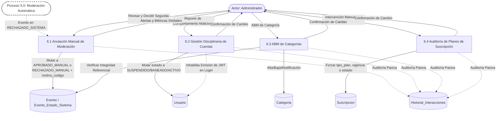

```mermaid
graph TD
    %% --- ENTIDADES EXTERNAS ---
    Admin([Actor: Administrador])
    P5_Ext([Proceso 5.0: Moderación Automática])

    %% --- ALMACENES DE DATOS ---
    subgraph Almacenes [ ]
        style Almacenes fill:none,stroke:none
        D2_Ev[(Evento / Evento_Estado_Sistema)]
        D1_Usr[(Usuario)]
        D2_Cat[(Categoria)]
        D4_Sus[(Suscripcion)]
        D6_Logs[(Historial_Interacciones)]
    end

    %% --- SUB-PROCESOS DEL MÓDULO 6 ---
    P6_1[6.1 Anulación Manual de Moderación]
    P6_2[6.2 Gestión Disciplinaria de Cuentas]
    P6_3[6.3 ABM de Categorías]
    P6_4[6.4 Auditoría de Planes de Suscripción]

    %% --- FLUJOS RF-6.1 ---
    P5_Ext -.->|Evento en RECHAZADO_SISTEMA| P6_1
    Admin -->|Revisar y Decidir Segunda Instancia| P6_1
    P6_1 -->|Mutar a APROBADO_MANUAL o RECHAZADO_MANUAL + motivo_codigo| D2_Ev

    %% --- FLUJOS RF-6.2 ---
    Admin -->|Reporte de Comportamiento Malicioso| P6_2
    P6_2 -->|Mutar estado a SUSPENDIDO/BANEADO/ACTIVO| D1_Usr
    P6_2 -.->|Inhabilita Emisión de JWT en Login| D1_Usr

    %% --- FLUJOS RF-6.3 ---
    Admin -->|ABM de Categoría| P6_3
    P6_3 -->|Verificar Integridad Referencial| D2_Ev
    P6_3 -->|Alta/Baja/Modificación| D2_Cat

    %% --- FLUJOS RF-6.4 ---
    Admin -->|Intervención Manual de Plan| P6_4
    P6_4 -->|Forzar tipo_plan, vigencia o estado| D4_Sus

    %% --- AUDITORÍA GLOBAL ---
    P6_1 -.->|Auditoría Pasiva| D6_Logs
    P6_2 -.->|Auditoría Pasiva| D6_Logs
    P6_3 -.->|Auditoría Pasiva| D6_Logs
    P6_4 -.->|Auditoría Pasiva| D6_Logs

    P6_1 -->|Alertas y Métricas Globales| Admin
    P6_2 -->|Confirmación de Cambio| Admin
    P6_3 -->|Confirmación de Cambio| Admin
    P6_4 -->|Confirmación de Cambio| Admin

    style P5_Ext fill:#fff,stroke:#333,stroke-dasharray: 5 5
```
