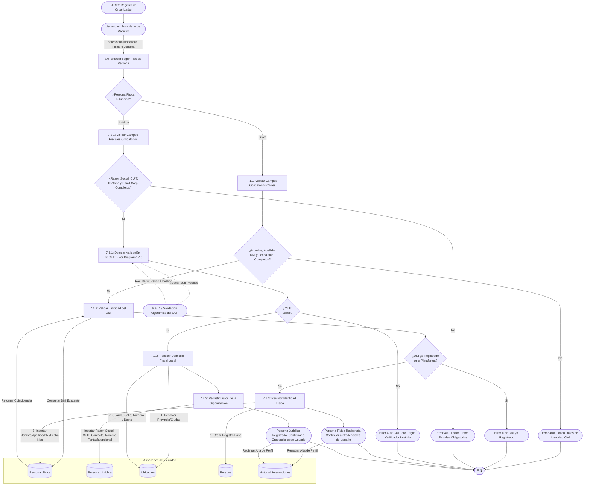

```mermaid
graph TD
    %% Punto de Inicio Único
    INICIO([INICIO: Registro de Organizador]) --> Org([Usuario en Formulario de Registro])
    Org -->|Selecciona Modalidad: Física o Jurídica| P7_0[7.0: Bifurcar según Tipo de Persona]

    %% Almacenes de Datos
    subgraph Almacenes de Identidad
        D1_PF[(Persona_Fisica)]
        D1_PJ[(Persona_Juridica)]
        D1_Ubi[(Ubicacion)]
        D1_Per[(Persona)]
        D6_Logs[(Historial_Interacciones)]
    end

    P7_0 --> C_Tipo{¿Persona Física<br>o Jurídica?}

    %% ===== RAMA A: PERSONA FÍSICA (RF-7.1) =====
    C_Tipo -->|Física| P7_1_1[7.1.1: Validar Campos Obligatorios Civiles]
    P7_1_1 --> C_CamposPF{¿Nombre, Apellido,<br>DNI y Fecha Nac. Completos?}
    C_CamposPF -->|No| Err_CamposPF([Error 400: Faltan Datos de Identidad Civil])
    C_CamposPF -->|Sí| P7_1_2[7.1.2: Validar Unicidad del DNI]

    P7_1_2 -->|Consultar DNI Existente| D1_PF
    D1_PF -->|Retornar Coincidencia| P7_1_2
    P7_1_2 --> C_DniUnico{¿DNI ya Registrado<br>en la Plataforma?}
    C_DniUnico -->|Sí| Err_DniDup([Error 409: DNI ya Registrado])
    C_DniUnico -->|No| P7_1_3[7.1.3: Persistir Identidad Física]

    P7_1_3 -->|1. Crear Registro Base| D1_Per
    P7_1_3 -->|2. Insertar Nombre/Apellido/DNI/Fecha Nac| D1_PF
    P7_1_3 --> Success_PF([Persona Física Registrada: Continuar a Credenciales de Usuario])

    %% ===== RAMA B: PERSONA JURÍDICA (RF-7.2) =====
    C_Tipo -->|Jurídica| P7_2_1[7.2.1: Validar Campos Fiscales Obligatorios]
    P7_2_1 --> C_CamposPJ{¿Razón Social, CUIT,<br>Teléfono y Email Corp. Completos?}
    C_CamposPJ -->|No| Err_CamposPJ([Error 400: Faltan Datos Fiscales Obligatorios])
    C_CamposPJ -->|Sí| P7_3_1[7.3.1: Delegar Validación de CUIT - Ver Diagrama 7.3]

    P7_3_1 -.->|Invocar Sub-Proceso| SubCUIT([Ir a: 7.3 Validación Algorítmica del CUIT])
    SubCUIT -.->|Resultado: Válido / Inválido| P7_3_1
    P7_3_1 --> C_CuitOk{¿CUIT<br>Válido?}
    C_CuitOk -->|No| Err_Cuit([Error 400: CUIT con Dígito Verificador Inválido])
    C_CuitOk -->|Sí| P7_2_2[7.2.2: Persistir Domicilio Fiscal Legal]

    P7_2_2 -->|1. Resolver Provincia/Ciudad| D1_Ubi
    P7_2_2 -->|2. Guardar Calle, Número y Depto| D1_Ubi
    P7_2_2 --> P7_2_3[7.2.3: Persistir Datos de la Organización]
    P7_2_3 -->|Insertar Razón Social, CUIT, Contacto, Nombre Fantasía opcional| D1_PJ
    P7_2_3 --> Success_PJ([Persona Jurídica Registrada: Continuar a Credenciales de Usuario])

    Success_PF -->|Registrar Alta de Perfil| D6_Logs
    Success_PJ -->|Registrar Alta de Perfil| D6_Logs

    %% Unificación de Salidas (Punto de Fin Único)
    Err_CamposPF --> FIN([FIN])
    Err_DniDup --> FIN
    Err_CamposPJ --> FIN
    Err_Cuit --> FIN
    Success_PF --> FIN
    Success_PJ --> FIN
```
