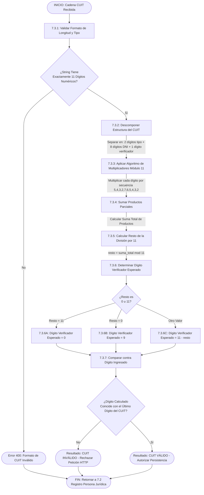

```mermaid
graph TD
    %% Punto de Inicio Único
    INICIO([INICIO: Cadena CUIT Recibida]) --> P7_3_1[7.3.1: Validar Formato de Longitud y Tipo]

    %% 1. VALIDACIÓN DE FORMATO BÁSICO
    P7_3_1 --> C_Longitud{¿String Tiene<br>Exactamente 11 Dígitos Numéricos?}
    C_Longitud -->|No| Err_Formato([Error 400: Formato de CUIT Inválido])
    C_Longitud -->|Sí| P7_3_2[7.3.2: Descomponer Estructura del CUIT]

    %% 2. DESCOMPOSICIÓN: TIPO + DNI + VERIFICADOR
    P7_3_2 -->|Separar en: 2 dígitos tipo + 8 dígitos DNI + 1 dígito verificador| P7_3_3[7.3.3: Aplicar Algoritmo de Multiplicadores Módulo 11]

    %% 3. CÁLCULO CRIPTOGRÁFICO MÓDULO 11
    P7_3_3 -->|Multiplicar cada dígito por secuencia 5,4,3,2,7,6,5,4,3,2| P7_3_4[7.3.4: Sumar Productos Parciales]
    P7_3_4 -->|Calcular Suma Total de Productos| P7_3_5[7.3.5: Calcular Resto de la División por 11]
    P7_3_5 -->|resto = suma_total mod 11| P7_3_6[7.3.6: Determinar Dígito Verificador Esperado]

    P7_3_6 --> C_RestoEspecial{¿Resto es<br>0 u 11?}
    C_RestoEspecial -->|Resto = 11| P7_3_6A[7.3.6A: Dígito Verificador Esperado = 0]
    C_RestoEspecial -->|Resto = 0| P7_3_6B[7.3.6B: Dígito Verificador Esperado = 9]
    C_RestoEspecial -->|Otro Valor| P7_3_6C[7.3.6C: Dígito Verificador Esperado = 11 - resto]

    P7_3_6A --> P7_3_7[7.3.7: Comparar contra Dígito Ingresado]
    P7_3_6B --> P7_3_7
    P7_3_6C --> P7_3_7

    %% 4. COMPARACIÓN FINAL
    P7_3_7 --> C_Coincide{¿Dígito Calculado<br>Coincide con el Último Dígito del CUIT?}
    C_Coincide -->|No| Err_Verificador([Resultado: CUIT INVÁLIDO - Rechazar Petición HTTP])
    C_Coincide -->|Sí| Success_Cuit([Resultado: CUIT VÁLIDO - Autorizar Persistencia])

    %% Unificación de Salidas (Punto de Fin Único, Retorna al Sub-Proceso 7.2)
    Err_Formato --> FIN([FIN: Retornar a 7.2 Registro Persona Jurídica])
    Err_Verificador --> FIN
    Success_Cuit --> FIN
```
