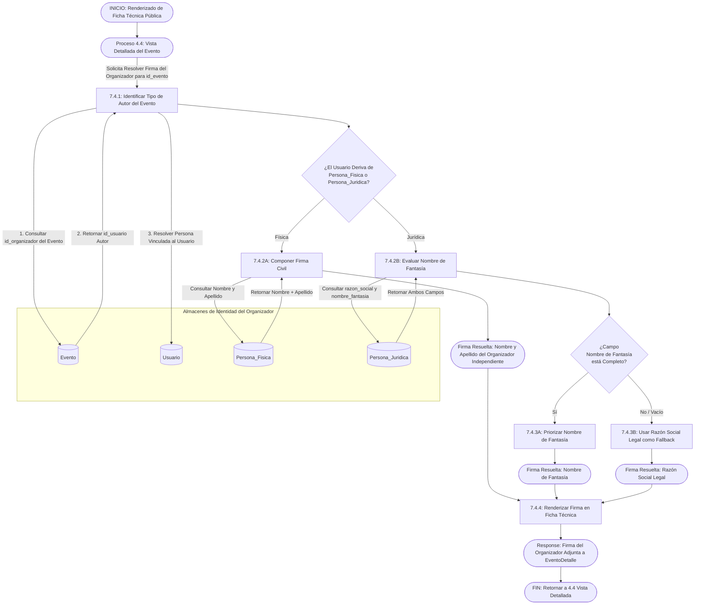

```mermaid
graph TD
    %% Punto de Inicio Único
    INICIO([INICIO: Renderizado de Ficha Técnica Pública]) --> P4_Ext([Proceso 4.4: Vista Detallada del Evento])
    P4_Ext -->|Solicita Resolver Firma del Organizador para id_evento| P7_4_1[7.4.1: Identificar Tipo de Autor del Evento]

    %% Almacenes de Datos
    subgraph Almacenes de Identidad del Organizador
        D10_Ev[(Evento)]
        D1_Usr[(Usuario)]
        D1_PF[(Persona_Fisica)]
        D1_PJ[(Persona_Juridica)]
    end

    %% 1. RESOLUCIÓN DE AUTORÍA
    P7_4_1 -->|1. Consultar id_organizador del Evento| D10_Ev
    D10_Ev -->|2. Retornar id_usuario Autor| P7_4_1
    P7_4_1 -->|3. Resolver Persona Vinculada al Usuario| D1_Usr
    P7_4_1 --> C_TipoPersona{¿El Usuario Deriva de<br>Persona_Fisica o Persona_Juridica?}

    %% ===== RAMA A: PERSONA FÍSICA =====
    C_TipoPersona -->|Física| P7_4_2A[7.4.2A: Componer Firma Civil]
    P7_4_2A -->|Consultar Nombre y Apellido| D1_PF
    D1_PF -->|Retornar Nombre + Apellido| P7_4_2A
    P7_4_2A --> Firma_PF([Firma Resuelta: Nombre y Apellido del Organizador Independiente])

    %% ===== RAMA B: PERSONA JURÍDICA =====
    C_TipoPersona -->|Jurídica| P7_4_2B[7.4.2B: Evaluar Nombre de Fantasía]
    P7_4_2B -->|Consultar razon_social y nombre_fantasia| D1_PJ
    D1_PJ -->|Retornar Ambos Campos| P7_4_2B
    P7_4_2B --> C_TieneFantasia{¿Campo<br>Nombre de Fantasía<br>está Completo?}

    C_TieneFantasia -->|Sí| P7_4_3A[7.4.3A: Priorizar Nombre de Fantasía]
    P7_4_3A --> Firma_Fantasia([Firma Resuelta: Nombre de Fantasía])

    C_TieneFantasia -->|No / Vacío| P7_4_3B[7.4.3B: Usar Razón Social Legal como Fallback]
    P7_4_3B --> Firma_RazonSocial([Firma Resuelta: Razón Social Legal])

    %% CONSOLIDACIÓN
    Firma_PF --> P7_4_4[7.4.4: Renderizar Firma en Ficha Técnica]
    Firma_Fantasia --> P7_4_4
    Firma_RazonSocial --> P7_4_4
    P7_4_4 --> Success_Firma([Response: Firma del Organizador Adjunta a EventoDetalle])

    %% Unificación de Salidas (Punto de Fin Único)
    Success_Firma --> FIN([FIN: Retornar a 4.4 Vista Detallada])
```
