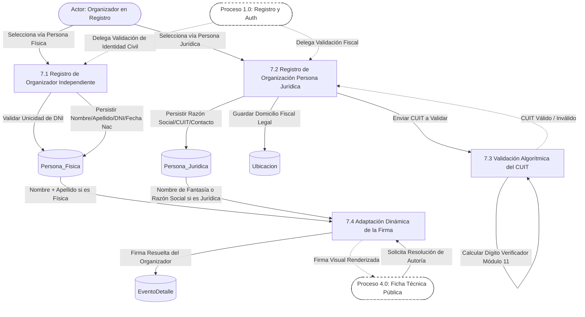

```mermaid
graph TD
    %% --- ENTIDADES EXTERNAS ---
    Org([Actor: Organizador en Registro])
    P1_Ext([Proceso 1.0: Registro y Auth])
    P4_Ext([Proceso 4.0: Ficha Técnica Pública])

    %% --- ALMACENES DE DATOS ---
    subgraph Almacenes [ ]
        style Almacenes fill:none,stroke:none
        D1_PF[(Persona_Fisica)]
        D1_PJ[(Persona_Juridica)]
        D1_Ubi[(Ubicacion)]
        D2_Det[(EventoDetalle)]
    end

    %% --- SUB-PROCESOS DEL MÓDULO 7 ---
    P7_1[7.1 Registro de Organizador Independiente]
    P7_2[7.2 Registro de Organización Persona Jurídica]
    P7_3[7.3 Validación Algorítmica del CUIT]
    P7_4[7.4 Adaptación Dinámica de la Firma]

    %% --- FLUJOS RF-7.1 ---
    Org -->|Selecciona vía Persona Física| P7_1
    P1_Ext -.->|Delega Validación de Identidad Civil| P7_1
    P7_1 -->|Validar Unicidad de DNI| D1_PF
    P7_1 -->|Persistir Nombre/Apellido/DNI/Fecha Nac| D1_PF

    %% --- FLUJOS RF-7.2 y RF-7.3 ---
    Org -->|Selecciona vía Persona Jurídica| P7_2
    P1_Ext -.->|Delega Validación Fiscal| P7_2
    P7_2 -->|Enviar CUIT a Validar| P7_3
    P7_3 -->|Calcular Dígito Verificador Módulo 11| P7_3
    P7_3 -.->|CUIT Válido / Inválido| P7_2
    P7_2 -->|Persistir Razón Social/CUIT/Contacto| D1_PJ
    P7_2 -->|Guardar Domicilio Fiscal Legal| D1_Ubi

    %% --- FLUJOS RF-7.4 ---
    P4_Ext -->|Solicita Resolución de Autoría| P7_4
    D1_PF -->|Nombre + Apellido si es Física| P7_4
    D1_PJ -->|Nombre de Fantasía o Razón Social si es Jurídica| P7_4
    P7_4 -->|Firma Resuelta del Organizador| D2_Det
    P7_4 -.->|Firma Visual Renderizada| P4_Ext

    style P1_Ext fill:#fff,stroke:#333,stroke-dasharray: 5 5
    style P4_Ext fill:#fff,stroke:#333,stroke-dasharray: 5 5
```
