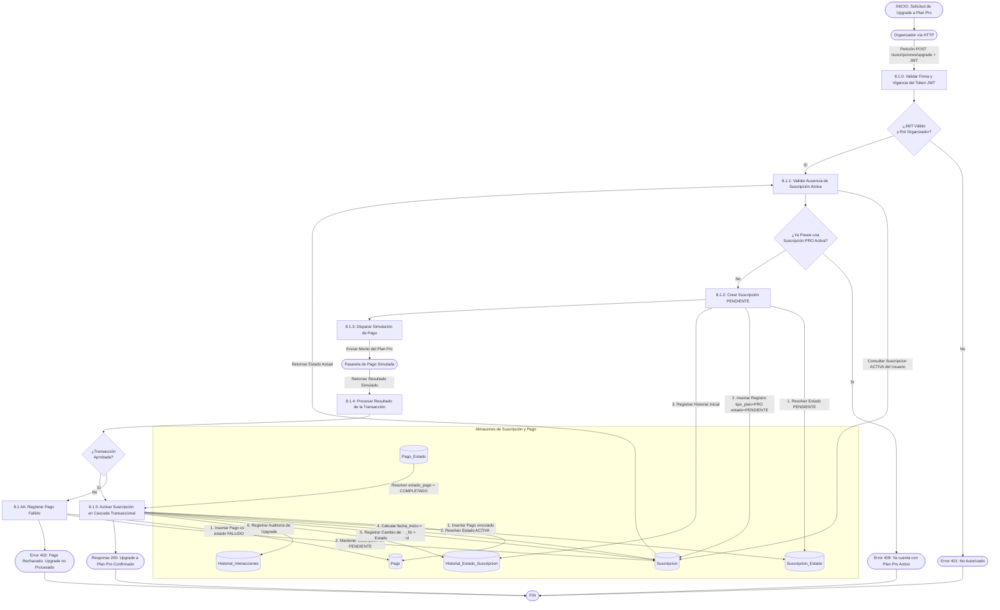

```mermaid
graph TD
    %% Punto de Inicio Único
    INICIO([INICIO: Solicitud de Upgrade a Plan Pro]) --> Org([Organizador vía HTTP])
    Org -->|Petición POST /suscripciones/upgrade + JWT| P8_1_0[8.1.0: Validar Firma y Vigencia del Token JWT]

    %% Almacenes de Datos
    subgraph Almacenes de Suscripción y Pago
        D20_Sus[(Suscripcion)]
        D20_SusEst[(Suscripcion_Estado)]
        D18_Pago[(Pago)]
        D19_PagoEst[(Pago_Estado)]
        D20_Hist[(Historial_Estado_Suscripcion)]
        D6_Logs[(Historial_Interacciones)]
    end

    Pasarela([Pasarela de Pago Simulada])

    %% 0. AUTENTICACIÓN
    P8_1_0 --> C_Token{¿JWT Válido<br>y Rol Organizador?}
    C_Token -->|No| Err_Auth([Error 401: No Autorizado])
    C_Token -->|Sí| P8_1_1[8.1.1: Validar Ausencia de Suscripción Activa]

    %% 1. VALIDACIÓN DE PRECONDICIÓN
    P8_1_1 -->|Consultar Suscripcion ACTIVA del Usuario| D20_Sus
    D20_Sus -->|Retornar Estado Actual| P8_1_1
    P8_1_1 --> C_YaPro{¿Ya Posee una<br>Suscripción PRO Activa?}
    C_YaPro -->|Sí| Err_YaPro([Error 409: Ya cuenta con Plan Pro Activo])
    C_YaPro -->|No| P8_1_2[8.1.2: Crear Suscripción PENDIENTE]

    %% 2. CREACIÓN INICIAL EN ESTADO PENDIENTE
    P8_1_2 -->|1. Resolver Estado PENDIENTE| D20_SusEst
    P8_1_2 -->|2. Insertar Registro tipo_plan=PRO estado=PENDIENTE| D20_Sus
    P8_1_2 -->|3. Registrar Historial Inicial| D20_Hist
    P8_1_2 --> P8_1_3[8.1.3: Disparar Simulación de Pago]

    %% 3. SIMULACIÓN DE PAGO (Delegado a Módulo de Pagos)
    P8_1_3 -->|Enviar Monto del Plan Pro| Pasarela
    Pasarela -->|Retornar Resultado Simulado| P8_1_4[8.1.4: Procesar Resultado de la Transacción]

    P8_1_4 --> C_PagoOk{¿Transacción<br>Aprobada?}

    %% CAMINO A: PAGO RECHAZADO
    C_PagoOk -->|No| P8_1_4A[8.1.4A: Registrar Pago Fallido]
    P8_1_4A -->|1. Insertar Pago con estado FALLIDO| D18_Pago
    P8_1_4A -->|2. Mantener Suscripcion en PENDIENTE| D20_Sus
    P8_1_4A --> Err_Pago([Error 402: Pago Rechazado. Upgrade no Procesado])

    %% CAMINO B: PAGO APROBADO - ACTIVACIÓN EN CASCADA
    C_PagoOk -->|Sí| P8_1_5[8.1.5: Activar Suscripción en Cascada Transaccional]
    P8_1_5 -->|1. Insertar Pago vinculado a Suscripcion| D18_Pago
    D19_PagoEst -->|Resolver estado_pago = COMPLETADO| P8_1_5
    P8_1_5 -->|2. Resolver Estado ACTIVA| D20_SusEst
    P8_1_5 -->|3. Mutar Suscripcion a ACTIVA| D20_Sus
    P8_1_5 -->|4. Calcular fecha_inicio = HOY y fecha_fin = HOY+30d| D20_Sus
    P8_1_5 -->|5. Registrar Cambio de Estado| D20_Hist
    P8_1_5 -->|6. Registrar Auditoría de Upgrade| D6_Logs
    P8_1_5 --> Success_Upgrade([Response 200: Upgrade a Plan Pro Confirmado])

    %% Unificación de Salidas (Punto de Fin Único)
    Err_Auth --> FIN([FIN])
    Err_YaPro --> FIN
    Err_Pago --> FIN
    Success_Upgrade --> FIN
```
