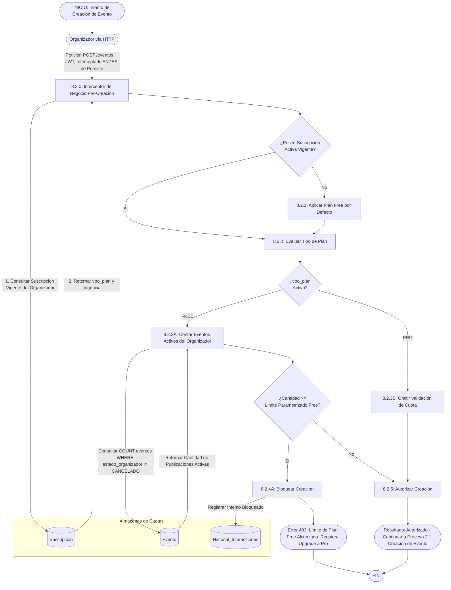

```mermaid
graph TD
    %% Punto de Inicio Único
    INICIO([INICIO: Intento de Creación de Evento]) --> Org([Organizador vía HTTP])
    Org -->|Petición POST /eventos + JWT, Interceptado ANTES de Persistir| P8_2_0[8.2.0: Interceptor de Negocio Pre-Creación]

    %% Almacenes de Datos
    subgraph Almacenes de Cuotas
        D20_Sus[(Suscripcion)]
        D10_Ev[(Evento)]
        D6_Logs[(Historial_Interacciones)]
    end

    %% 1. RESOLUCIÓN DEL PLAN ACTIVO
    P8_2_0 -->|1. Consultar Suscripcion Vigente del Organizador| D20_Sus
    D20_Sus -->|2. Retornar tipo_plan y Vigencia| P8_2_0
    P8_2_0 --> C_TienePlan{¿Posee Suscripción<br>Activa Vigente?}

    %% Sin suscripción registrada = Plan Free por defecto
    C_TienePlan -->|No| P8_2_1[8.2.1: Aplicar Plan Free por Defecto]
    C_TienePlan -->|Sí| P8_2_2[8.2.2: Evaluar Tipo de Plan]
    P8_2_1 --> P8_2_2

    P8_2_2 --> C_TipoPlan{¿tipo_plan<br>Activo?}

    %% ===== RAMA A: PLAN FREE (RESTRICTIVO) =====
    C_TipoPlan -->|FREE| P8_2_3A[8.2.3A: Contar Eventos Activos del Organizador]
    P8_2_3A -->|Consultar COUNT eventos WHERE estado_organizador != CANCELADO| D10_Ev
    D10_Ev -->|Retornar Cantidad de Publicaciones Activas| P8_2_3A
    P8_2_3A --> C_LimiteFree{¿Cantidad >=<br>Límite Parametrizado Free?}

    C_LimiteFree -->|Sí| P8_2_4A[8.2.4A: Bloquear Creación]
    P8_2_4A -->|Registrar Intento Bloqueado| D6_Logs
    P8_2_4A --> Err_Limite([Error 403: Límite de Plan Free Alcanzado. Requiere Upgrade a Pro])

    C_LimiteFree -->|No| P8_2_5[8.2.5: Autorizar Creación]

    %% ===== RAMA B: PLAN PRO (SIN RESTRICCIÓN) =====
    C_TipoPlan -->|PRO| P8_2_3B[8.2.3B: Omitir Validación de Cuota]
    P8_2_3B --> P8_2_5

    P8_2_5 --> Success_Autorizado([Resultado: Autorizado - Continuar a Proceso 2.1 Creación de Evento])

    %% Unificación de Salidas (Punto de Fin Único)
    Err_Limite --> FIN([FIN])
    Success_Autorizado --> FIN
```
