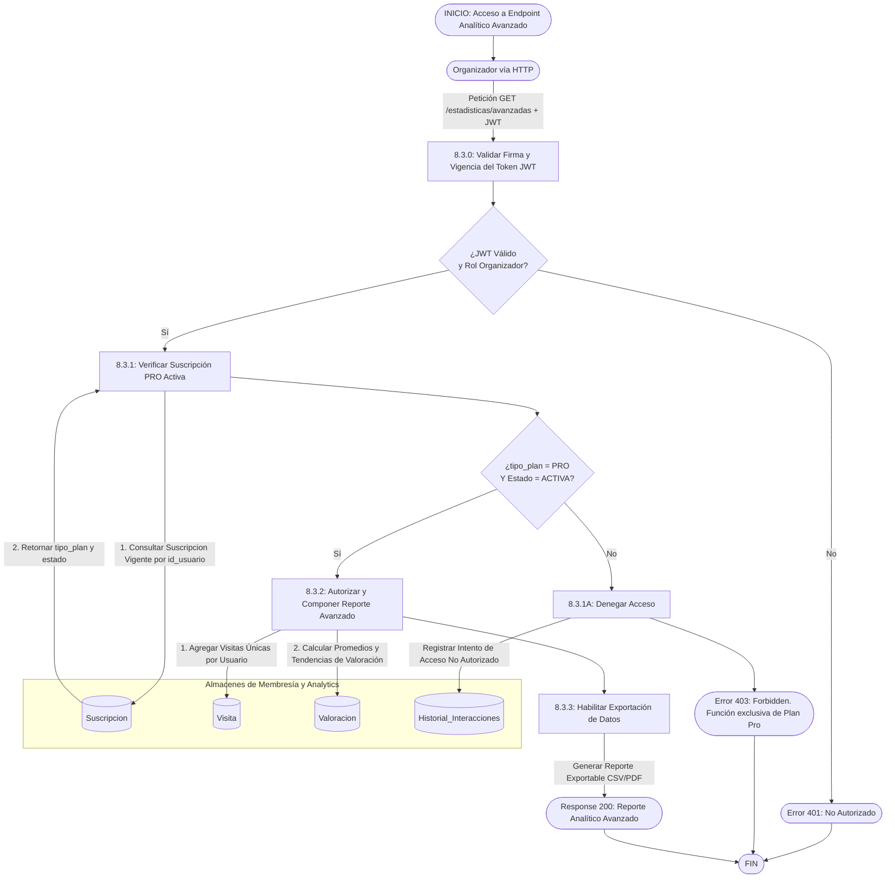

```mermaid
graph TD
    %% Punto de Inicio Único
    INICIO([INICIO: Acceso a Endpoint Analítico Avanzado]) --> Org([Organizador vía HTTP])
    Org -->|Petición GET /estadisticas/avanzadas + JWT| P8_3_0[8.3.0: Validar Firma y Vigencia del Token JWT]

    %% Almacenes de Datos
    subgraph Almacenes de Membresía y Analytics
        D20_Sus[(Suscripcion)]
        D5_Vis[(Visita)]
        D16_Val[(Valoracion)]
        D6_Logs[(Historial_Interacciones)]
    end

    %% 0. AUTENTICACIÓN Y RBAC
    P8_3_0 --> C_Token{¿JWT Válido<br>y Rol Organizador?}
    C_Token -->|No| Err_Auth([Error 401: No Autorizado])
    C_Token -->|Sí| P8_3_1[8.3.1: Verificar Suscripción PRO Activa]

    %% 1. VALIDACIÓN DE MEMBRESÍA (INDEPENDIENTE DE CLAIM EN JWT)
    P8_3_1 -->|1. Consultar Suscripcion Vigente por id_usuario| D20_Sus
    D20_Sus -->|2. Retornar tipo_plan y estado| P8_3_1
    P8_3_1 --> C_EsPro{¿tipo_plan = PRO<br>Y Estado = ACTIVA?}

    %% CAMINO A: ACCESO DENEGADO (PLAN FREE)
    C_EsPro -->|No| P8_3_1A[8.3.1A: Denegar Acceso]
    P8_3_1A -->|Registrar Intento de Acceso No Autorizado| D6_Logs
    P8_3_1A --> Err_403([Error 403: Forbidden. Función exclusiva de Plan Pro])

    %% CAMINO B: ACCESO AUTORIZADO (PLAN PRO)
    C_EsPro -->|Sí| P8_3_2[8.3.2: Autorizar y Componer Reporte Avanzado]
    P8_3_2 -->|1. Agregar Visitas Únicas por Usuario| D5_Vis
    P8_3_2 -->|2. Calcular Promedios y Tendencias de Valoración| D16_Val
    P8_3_2 --> P8_3_3[8.3.3: Habilitar Exportación de Datos]
    P8_3_3 -->|Generar Reporte Exportable CSV/PDF| Success_Reporte([Response 200: Reporte Analítico Avanzado])

    %% Unificación de Salidas (Punto de Fin Único)
    Err_Auth --> FIN([FIN])
    Err_403 --> FIN
    Success_Reporte --> FIN
```
