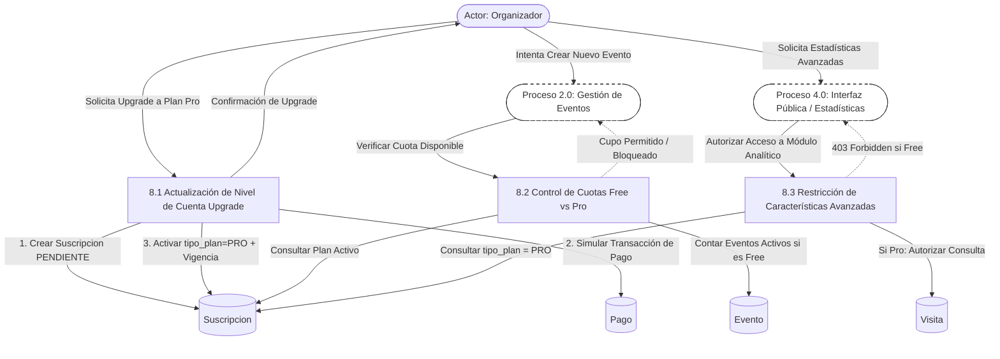

```mermaid
graph TD
    %% --- ENTIDADES EXTERNAS ---
    Org([Actor: Organizador])
    P2_Ext([Proceso 2.0: Gestión de Eventos])
    P4_Ext([Proceso 4.0: Interfaz Pública / Estadísticas])

    %% --- ALMACENES DE DATOS ---
    subgraph Almacenes [ ]
        style Almacenes fill:none,stroke:none
        D4_Sus[(Suscripcion)]
        D4_Pago[(Pago)]
        D2_Ev[(Evento)]
        D5_Vis[(Visita)]
    end

    %% --- SUB-PROCESOS DEL MÓDULO 8 ---
    P8_1[8.1 Actualización de Nivel de Cuenta Upgrade]
    P8_2[8.2 Control de Cuotas Free vs Pro]
    P8_3[8.3 Restricción de Características Avanzadas]

    %% --- FLUJOS RF-8.1 ---
    Org -->|Solicita Upgrade a Plan Pro| P8_1
    P8_1 -->|1. Crear Suscripcion PENDIENTE| D4_Sus
    P8_1 -->|2. Simular Transacción de Pago| D4_Pago
    P8_1 -->|3. Activar tipo_plan=PRO + Vigencia| D4_Sus
    P8_1 -->|Confirmación de Upgrade| Org

    %% --- FLUJOS RF-8.2 ---
    Org -->|Intenta Crear Nuevo Evento| P2_Ext
    P2_Ext -->|Verificar Cuota Disponible| P8_2
    P8_2 -->|Consultar Plan Activo| D4_Sus
    P8_2 -->|Contar Eventos Activos si es Free| D2_Ev
    P8_2 -.->|Cupo Permitido / Bloqueado| P2_Ext

    %% --- FLUJOS RF-8.3 ---
    Org -->|Solicita Estadísticas Avanzadas| P4_Ext
    P4_Ext -->|Autorizar Acceso a Módulo Analítico| P8_3
    P8_3 -->|Consultar tipo_plan = PRO| D4_Sus
    P8_3 -->|Si Pro: Autorizar Consulta| D5_Vis
    P8_3 -.->|403 Forbidden si Free| P4_Ext

    style P2_Ext fill:#fff,stroke:#333,stroke-dasharray: 5 5
    style P4_Ext fill:#fff,stroke:#333,stroke-dasharray: 5 5
```
